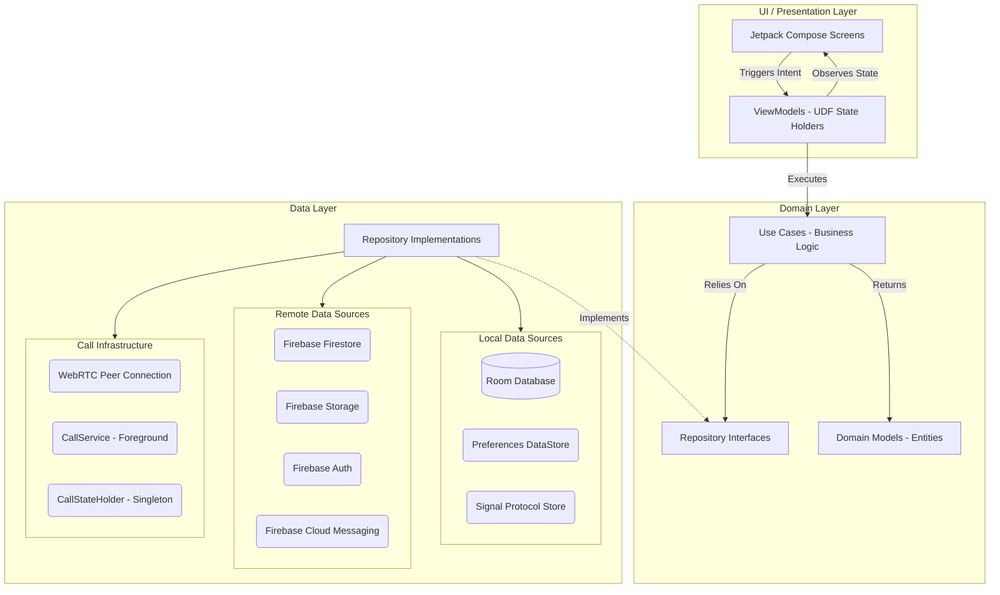
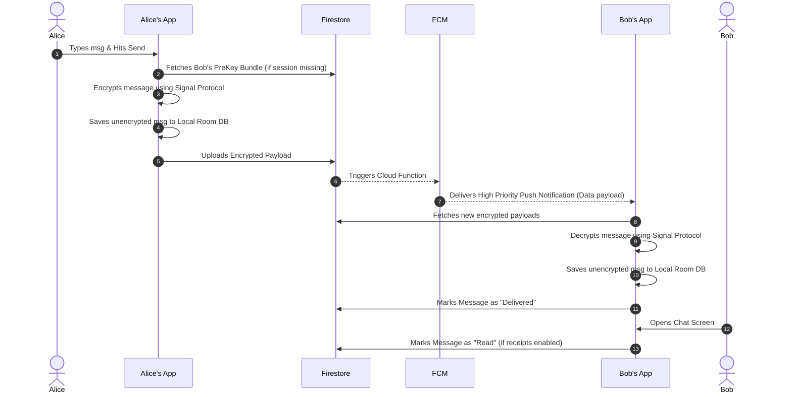
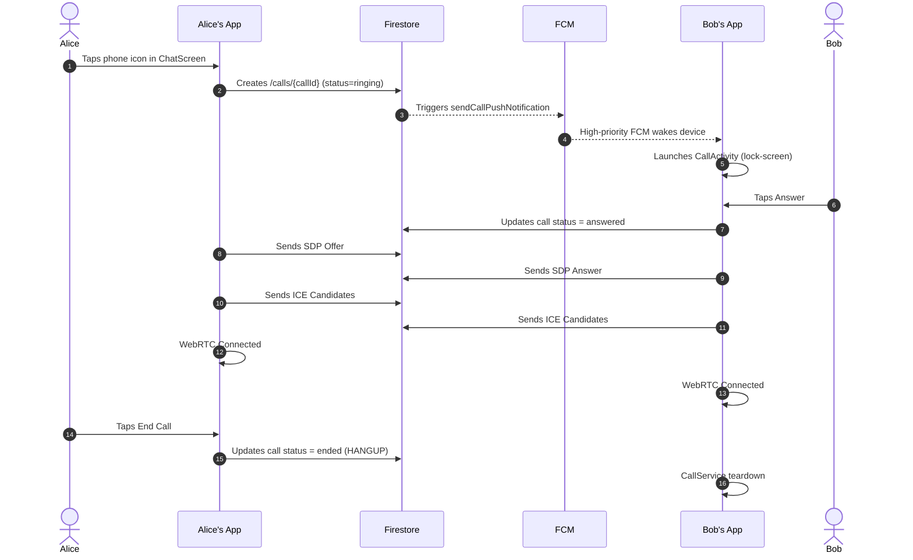
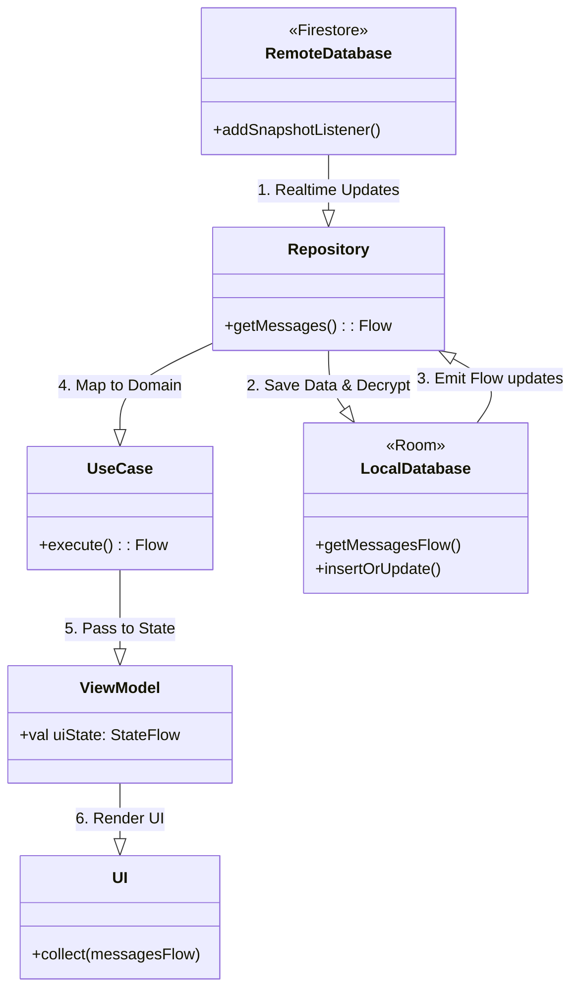
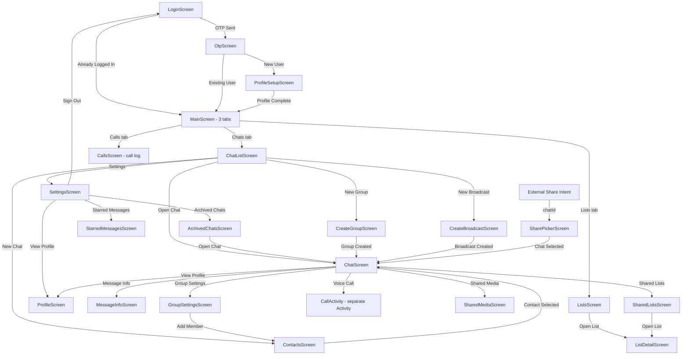

# FireStream Chat Spec and Architecture

This document provides a detailed specification and architectural overview of the **FireStream** application, a real-time messaging Android application built with modern Android development practices, end-to-end encryption, and a robust feature set resembling modern chat apps (e.g., WhatsApp, Signal).

## 1. Specification / Features

Moved — see [SPEC.md](SPEC.md) for the full product feature list.

---

## 2. Technology Stack

- **Platform**: Android
- **Language**: Kotlin
- **UI Toolkit**: Jetpack Compose
- **Architecture**: Clean Architecture + MVVM (Model-View-ViewModel) + UDF (Unidirectional Data Flow)
- **Dependency Injection**: Dagger Hilt
- **Local Database**: Room (SQLite) with Coroutines Flow for reactive updates
- **Preferences**: Jetpack DataStore (Preferences DataStore)
- **Backend Infrastructure**: Firebase Services
  - **Firestore**: Real-time NoSQL database for syncing encrypted payloads, user statuses, typing indicators, and call signaling.
  - **Firebase Authentication**: Phone authentication mechanism.
  - **Cloud Storage**: Hosting user avatars, images, and voice recordings.
  - **Cloud Functions**: Server-side triggers — push notifications on new messages (`sendPushNotification`) and incoming calls (`sendCallPushNotification`). Runtime: Node.js 20.
  - **Firebase Cloud Messaging (FCM)**: Reliable push notifications for background delivery wake-ups and incoming call alerts.
- **Cryptography**: `libsignal-android` for industry-standard Signal Protocol end-to-end encryption (including post-quantum Kyber pre-keys).
- **Real-Time Communication**: `stream-webrtc-android` for WebRTC-based voice calls.
- **Image Loading**: Coil
- **Concurrency**: Kotlin Coroutines & Flow

---

## 3. High-Level Architecture (Clean Architecture)

FireStream strictly adheres to Clean Architecture principles separating responsibilities into three distinct layers: **Domain**, **Data**, and **UI/Presentation**.



### 3.1 Domain Layer

The most isolated layer, containing enterprise-wide and application-specific business logic.

- **Models**: 18 plain Kotlin data classes (`Message`, `User`, `Chat`, `Contact`, `Poll`, `PollOption`, `CallState`, `CallLogEntry`, `CallSignalingData`, `IceCandidateData`, `GroupPermissions`, `GroupRole`, `ListData`, `ListItem`, `ListDiff`, `ListHistoryEntry`, `HistoryAction`, `MediaAttachment`, `SharedContent`, `MessageStatus`, `MessageType`, `ChatType`). Extracted from framework-specific models (like Room Entities or Firestore Snapshots).
- **Repository Interfaces**: 8 abstractions (`AuthRepository`, `CallRepository`, `ChatRepository`, `ContactRepository`, `ListRepository`, `MessageRepository`, `PollRepository`, `UserRepository`) dictating what required data operations are available without knowing _how_ they're implemented.
- **Use Cases**: Single-responsibility executors organized into `chat/`, `list/`, and `message/` subdirectories: `CheckGroupPermissionUseCase`, `SendListUpdateToChatsUseCase`, `SearchMessagesUseCase`.

### 3.2 Data Layer

The concrete implementation resolving the Repository Interfaces.

- **Local Sources**: Room handles the reactive caching. The app primarily drives the UI from Room via `Flow`. Two databases live side by side: `AppDatabase` (`fire_stream_chat.db`) for application data and `SignalDatabase` (`signal.db`) for Signal Protocol key material — splitting them means destructive schema migrations on application data cannot wipe cryptographic state.
- **Remote Sources**: Firebase services. The repository layer typically observes Firestore, writes modifications to Room, and the UI reacts to the Room changes.
- **Crypto Sources**: `SignalManager` and `SignalProtocolStoreImpl` orchestrate key generation, pre-key bundles, and encryption/decryption cycles transparently to the upper layers.
- **Media Infrastructure**: `MediaFileManager` (@Singleton) manages local media storage at `filesDir/media/{chatId}/{messageId}.{ext}` and gallery export via MediaStore (`Pictures/FireStream`). `ImageCompressor` (@Singleton) provides EXIF-aware compression with `inSampleSize` for memory-safe decode (1600px/80% JPEG default, full quality opt-in via DataStore). `MediaBackfillWorker` (WorkManager) runs a one-time job on first launch to download existing media, respecting `AutoDownloadOption` and network constraints.
- **Call Infrastructure**: `CallService` (foreground service) owns the WebRTC peer connection lifecycle. `CallStateHolder` (@Singleton) bridges the service to the UI via `StateFlow`. `CallActivity` is a separate Android Activity (not a NavHost destination) for lock-screen support.

### 3.3 UI / Presentation Layer

- **ViewModels**: Maintain view state (`StateFlow` of `UiState` data classes). Handle user intents and translate UI actions into domain use case executions.
- **Jetpack Compose Screens**: Declarative, composable functions rendering UI strictly based on the provided immutable `UiState`.
- **ChatScreen** is split into 24 focused files (`MessageBubble`, `VoiceMessagePlayer`, `LinkPreviewCard`, `FullscreenImageViewer`, `ImagePreviewScreen`, `ForwardChatPicker`, `EmojiHandlerPanel`, `EmojiSearchData`, `PollBubble`, `CreatePollSheet`, `ListBubble`, `CreateListSheet`, `SharedMediaScreen`, `SharedMediaViewModel`, `ChatUtils`, `MessageInfoScreen`, `ChatScreen`, `ChatViewModel`, plus 6 manager classes — `ChatPollManager`, `ChatSearchManager`, `ChatMessageActions`, `ChatMessageSender`, `ChatMessageLoader`, `ChatInfoManager`), all with `internal` visibility. `ChatViewModel` is a thin orchestrator (~220 lines) that constructs and delegates to the 6 managers; all managers share a single `MutableStateFlow<ChatUiState>` reference.
- **Bottom navigation**: `MainScreen` (`ui/main/`) hosts a `HorizontalPager` with three tabs — Chats, Calls, and Lists. `BottomNavBar` and the swipe gesture live exclusively in `MainScreen`; individual tab screens (`ChatListScreen`, `CallsScreen`, `ListsScreen`) do **not** own the nav bar. The `CHAT_LIST` NavHost route renders `MainScreen`; the Calls and Lists tabs are internal pager state, not NavHost destinations.

---

## 4. End-to-End Encryption Flow

The messaging pipeline uses the Signal Protocol. Below is the sequence describing how sending and receiving an encrypted message works.



> **Debug builds**: Encryption is bypassed — `MessageRepositoryImpl` calls `sendPlainMessage()` instead of the encrypted path, avoiding key-loss issues during development.
>
> **Release builds**: Users may opt out of Signal end-to-end encryption from Settings → Privacy. The flag is read from `PreferencesDataStore.e2eEncryptionEnabledFlow` (default `true`) and gates the same `sendPlainMessage()` branch.

---

## 5. Voice Call Signaling Flow

Voice calls use WebRTC for media and Firestore for signaling.



### Call Architecture Details

- **`CallService`** (foreground service): Owns the `PeerConnection` lifecycle, ICE negotiation, and audio stream management.
- **`CallStateHolder`** (@Singleton): Exposes `StateFlow<CallState>` and `StateFlow<CallUiControls>`. Bridges `CallService` ↔ UI without binding to the service.
- **`CallActivity`** (separate Activity): Not a NavHost route. Launched via Intent. Supports lock-screen rendering.
- **`CallState`** (sealed interface): `Idle | OutgoingRinging | IncomingRinging | Connecting | Connected | Ended(EndReason)`.

---

## 6. Offline-First Data Synchronization

The application relies heavily on Room as the **Single Source of Truth**. The UI very rarely reads directly from Firestore; it reads from Room Dao `Flow` streams.



---

## 7. Real-Time Status & Read Receipts Algorithm

Tracking message delivery involves an interplay between Android background services (FCM), foreground composables, and strict privacy logic.


### Status Implementation Details

1. **SENT**: Assigned after a successful `firestore.document(id).set(...)` call.
2. **DELIVERED**: Triggered via two vectors:
   - **Background**: `FCMService` intercepts a data push, extracts `messageId`, and updates Firestore status to `DELIVERED`.
   - **Foreground**: `ChatListViewModel` or `ChatViewModel` processes the Firestore snapshot and marks pending messages as `DELIVERED`.
3. **READ**: Updated when the recipient enters `ChatScreen`. `ChatViewModel` checks `PreferencesDataStore` (local) and the `User` document (remote) to confirm both parties consent via `readReceiptsEnabled`. Read receipts are always hidden for `BROADCAST` chats.
4. **Group tracking**: `readBy: Map<String, Long>` and `deliveredTo: Map<String, Long>` track per-recipient timestamps for group messages.

---

## 8. Database Entity Schema (Room)

Moved — see [SCHEMA-ROOM.md](SCHEMA-ROOM.md) for the full Room ER diagram and table listing.

---

## 9. Firestore & Realtime Database Schema

Moved — see [SCHEMA-FIRESTORE.md](SCHEMA-FIRESTORE.md) for Firestore collections, RTDB paths, and key patterns.

---

## 10. Domain Models

Moved — see [DOMAIN-MODELS.md](DOMAIN-MODELS.md) for the Kotlin data classes.

---

## 11. Screen Navigation Architecture

The application uses a single `NavHost` in `MainActivity` for all routes except `CallActivity`, which is launched via Intent for lock-screen support. The `CHAT_LIST` route renders `MainScreen`, which hosts a `HorizontalPager` with Chats, Calls, and Lists tabs — the Calls and Lists tabs are internal pager state, not NavHost routes.



### Navigation Routes

| Route              | Arguments                    | Description                        |
| ------------------ | ---------------------------- | ---------------------------------- |
| `LOGIN`            | —                            | Phone number entry                 |
| `OTP`              | verificationId, phoneNumber  | OTP verification                   |
| `PROFILE_SETUP`    | —                            | Initial profile creation           |
| `CHAT_LIST`        | —                            | Main screen (renders `MainScreen`) |
| `CHAT`             | chatId, recipientId          | Chat conversation                  |
| `CONTACTS`         | —                            | Contact list for new chat          |
| `MESSAGE_INFO`     | messageId, chatId            | Delivery/read timestamps           |
| `SETTINGS`         | —                            | App settings                       |
| `USER_PROFILE`     | userId                       | User profile view                  |
| `STARRED_MESSAGES` | —                            | Bookmarked messages                |
| `ARCHIVED_CHATS`   | —                            | Archived conversations             |
| `GROUP_SETTINGS`   | chatId                       | Group admin screen                 |
| `CREATE_GROUP`     | —                            | Group creation                     |
| `CREATE_BROADCAST` | —                            | Broadcast list creation            |
| `SHARE_PICKER`     | —                            | External share target              |
| `SHARED_MEDIA`     | chatId                       | Shared images gallery for a chat   |
| `LIST_DETAIL`      | listId, autoFocus            | List editing / detail view         |
| `SHARED_LISTS`     | chatId                       | Lists shared into a specific chat  |

---

## 12. Package Layout

```
com.firestream.chat/
├── data/
│   ├── call/                    # WebRTC infrastructure
│   │   ├── CallService.kt       # Foreground service — owns PeerConnection
│   │   ├── CallStateHolder.kt   # @Singleton state bridge (service ↔ UI)
│   │   ├── CallNotificationManager.kt
│   │   └── WebRtcPeerConnectionFactory.kt
│   ├── crypto/
│   │   ├── SignalManager.kt
│   │   └── SignalProtocolStoreImpl.kt
│   ├── local/
│   │   ├── dao/                 # ChatDao, ContactDao, ListDao, MessageDao, SignalDao, UserDao
│   │   ├── entity/              # 5 core (Chat, Contact, List, Message, User) + 6 Signal entities + SignalTrustedIdentity
│   │   ├── AppDatabase.kt       # fire_stream_chat.db — application data
│   │   ├── SignalDatabase.kt    # signal.db — Signal Protocol key material (split from AppDatabase)
│   │   ├── Converters.kt
│   │   └── PreferencesDataStore.kt
│   ├── util/
│   │   ├── ImageCompressor.kt   # EXIF-aware compression, memory-safe decode
│   │   ├── MediaFileManager.kt  # Local media storage & gallery export
│   │   ├── ProfileImageManager.kt # Avatar download/cache management
│   │   ├── SpeechRecognizerManager.kt # System SpeechRecognizer wrapper for composer dictation
│   │   ├── ResultExt.kt         # Result extension helpers
│   │   └── CurrentActivityHolder.kt
│   ├── worker/
│   │   └── MediaBackfillWorker.kt # WorkManager job to backfill local media
│   ├── remote/
│   │   ├── fcm/                 # FCMService, ActiveChatTracker
│   │   ├── firebase/            # FirebaseAuthSource, FirestoreChatSource,
│   │   │                        # FirestoreCallSource, FirestoreListSource,
│   │   │                        # FirestoreListHistorySource, FirestoreMessageSource,
│   │   │                        # FirestoreUserSource, FirebaseKeySource,
│   │   │                        # FirebaseStorageSource, RealtimePresenceSource,
│   │   │                        # LinkPreviewSource
│   │   └── WebPagePreviewCapture.kt # Off-screen WebView screenshot fallback
│   ├── repository/              # AuthRepositoryImpl, CallRepositoryImpl,
│   │                            # ChatRepositoryImpl, ContactRepositoryImpl,
│   │                            # ListRepositoryImpl, MessageRepositoryImpl,
│   │                            # PollRepositoryImpl, PollMapper,
│   │                            # UserRepositoryImpl
│   └── share/
│       ├── SharedContentHolder.kt
│       └── ShareContentResolver.kt
├── di/                          # AppModule, DatabaseModule, CryptoModule, NetworkModule, SystemModule
├── domain/
│   ├── model/                   # Chat, Message, User, Contact, Poll, PollOption,
│   │                            # CallState, CallLogEntry, CallSignalingData, SdpData,
│   │                            # IceCandidateData, GroupPermissions, GroupRole,
│   │                            # ListData, ListItem, ListDiff, ListType, GenericListStyle,
│   │                            # ListHistoryEntry, HistoryAction, MediaAttachment,
│   │                            # SharedContent, MessageStatus, MessageType, ChatType
│   ├── repository/              # AuthRepository, CallRepository, ChatRepository, ContactRepository,
│   │                            # ListRepository, MessageRepository, PollRepository, UserRepository
│   ├── usecase/
│   │   ├── chat/                # CheckGroupPermissionUseCase
│   │   ├── list/                # SendListUpdateToChatsUseCase
│   │   └── message/             # SearchMessagesUseCase
│   └── util/MentionParser.kt
├── navigation/NavGraph.kt
├── ui/
│   ├── auth/                    # Login, Otp, ProfileSetup, AuthViewModel
│   ├── broadcast/               # CreateBroadcastScreen, CreateBroadcastViewModel
│   ├── call/                    # CallActivity, CallScreen, CallViewModel, CallControlButton
│   ├── calls/                   # CallsScreen, CallsViewModel (call log tab)
│   ├── chat/                    # ChatScreen, ChatViewModel (orchestrator),
│   │                            # ChatPollManager, ChatSearchManager, ChatMessageActions,
│   │                            # ChatMessageSender, ChatMessageLoader, ChatInfoManager,
│   │                            # ChatDictationManager, DictationControlBar, TypingRow,
│   │                            # MessageBubble, VoiceMessagePlayer, LinkPreviewCard,
│   │                            # FullscreenImageViewer, ImagePreviewScreen,
│   │                            # ForwardChatPicker, LocationPickerSheet,
│   │                            # EmojiHandlerPanel, EmojiSearchData, SwipeReactionPanel,
│   │                            # PollBubble, CreatePollSheet, ListBubble, CreateListSheet,
│   │                            # SharedMediaScreen, SharedMediaViewModel,
│   │                            # MessageInfoScreen, ChatUtils, BubbleTailShape,
│   │                            # MentionFormatter, MessageGrouping
│   ├── chatlist/                # ChatListScreen, ChatListViewModel, ChatListItem,
│   │                            # ArchivedChatsScreen
│   ├── components/              # UserAvatar, ImagePicker, SkeletonLoading, TypingIndicator
│   ├── contacts/                # ContactsScreen, ContactsViewModel
│   ├── group/                   # CreateGroupScreen, CreateGroupViewModel,
│   │                            # GroupSettingsScreen, GroupSettingsViewModel,
│   │                            # QrCodeGenerator
│   ├── lists/                   # ListsScreen, ListsViewModel, ListDetailScreen,
│   │                            # ListDetailViewModel, SharedListsScreen,
│   │                            # SharedListsViewModel, AvatarStack,
│   │                            # ListContextSheet, ListShareSheet
│   ├── main/                    # MainScreen (HorizontalPager — Chats/Calls/Lists tabs),
│   │                            # BottomNavBar
│   ├── profile/                 # ProfileScreen, ProfileViewModel
│   ├── settings/                # SettingsScreen, SettingsViewModel
│   ├── share/                   # SharePickerScreen, SharePickerViewModel
│   ├── starred/                 # StarredMessagesScreen, StarredMessagesViewModel
│   └── theme/                   # Color, Shape, Theme, Type
├── AppLifecycleObserver.kt      # Process-level lifecycle — drives RTDB online/offline presence
├── FireStreamApp.kt
└── MainActivity.kt
```

---

## 13. Firebase Cloud Functions

Moved — see [CLOUD-FUNCTIONS.md](CLOUD-FUNCTIONS.md) for trigger details and FCM payload shapes.
