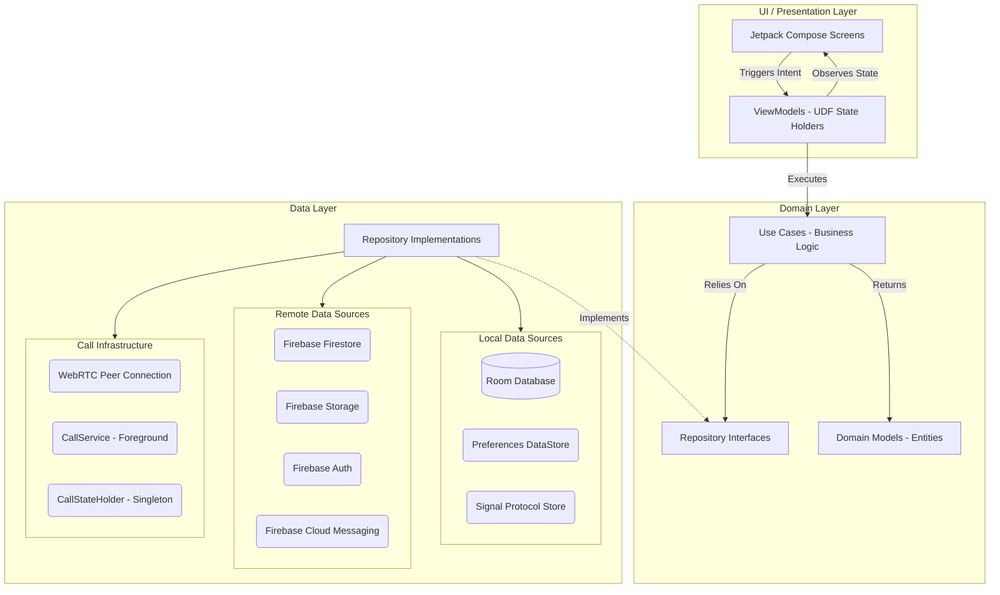
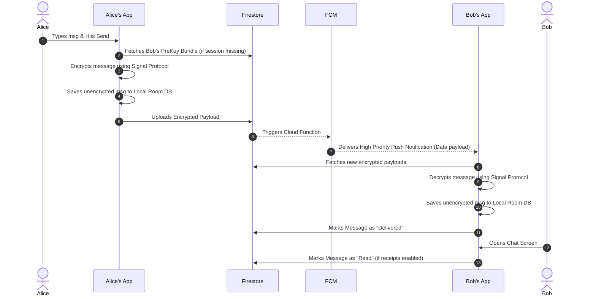
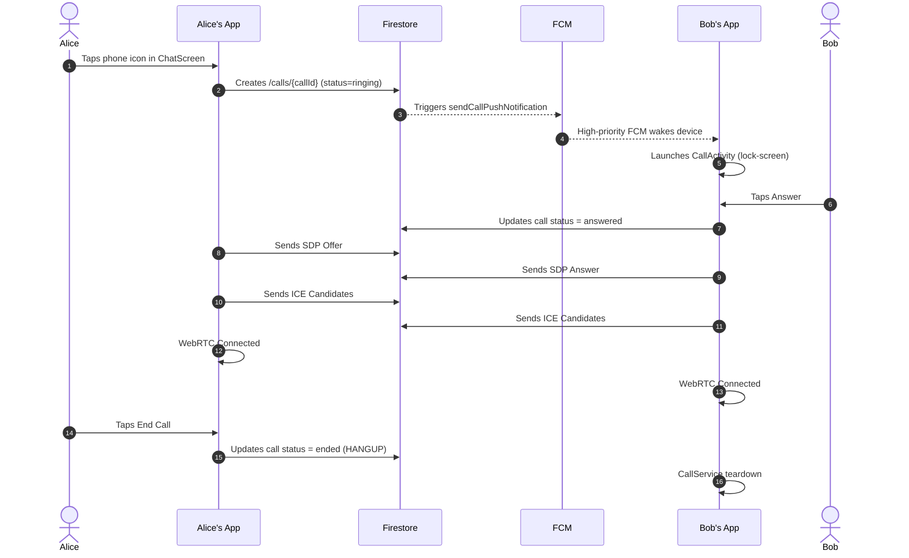
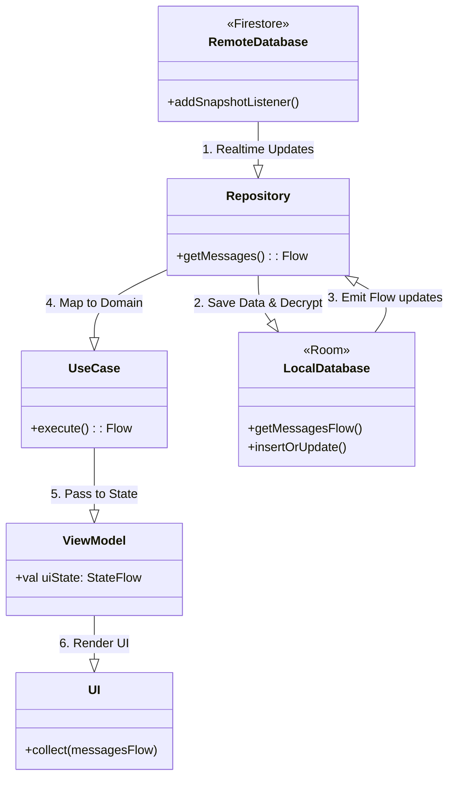
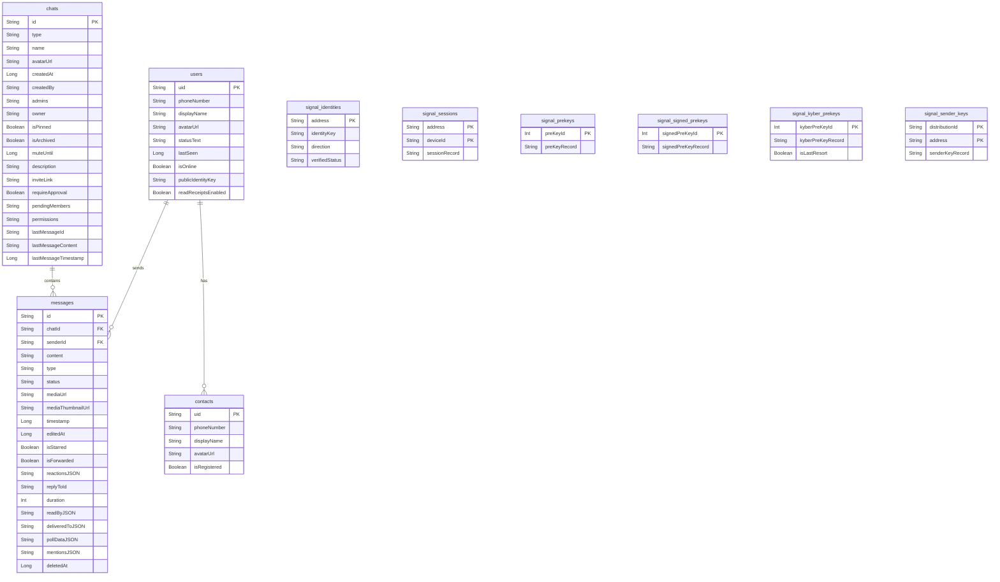
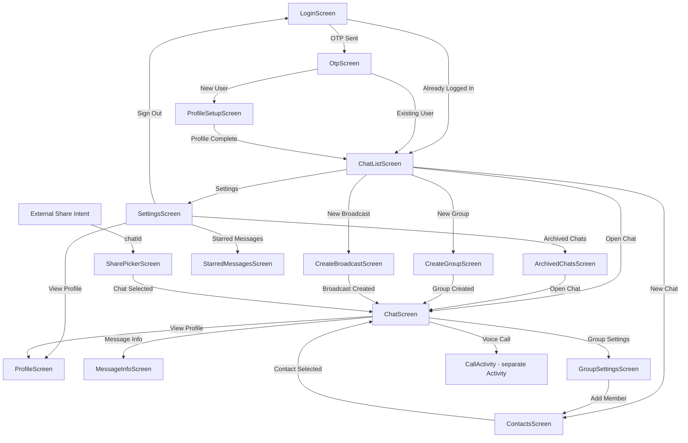

# FireStream Chat Spec and Architecture

This document provides a detailed specification and architectural overview of the **FireStream** application, a real-time messaging Android application built with modern Android development practices, end-to-end encryption, and a robust feature set resembling modern chat apps (e.g., WhatsApp, Signal).

## 1. Specification / Features

### Core Messaging

- **1-on-1 Chat**: Text messaging with real-time syncing.
- **Media Support**: Send and receive images, voice messages, and generic documents. Includes a fullscreen image viewer and voice media player with adjustable playback speed.
- **End-to-End Encryption (E2EE)**: All messages are encrypted natively on the client device using the **Signal Protocol** before transmission. Encryption is disabled in debug builds (`BuildConfig.DEBUG` guard) — messages are sent as plaintext to avoid key-loss issues during development.
- **Read Receipts Status**:
  - **Sent** (Single gray tick): Message reached the server.
  - **Delivered** (Double gray tick): Message reached the recipient's device.
  - **Read** (Double blue tick): Recipient opened and viewed the conversation.
  - **Privacy Control**: Users can disable read receipts (Bidirectional enforcement: if disabled by either user, both users see only up to the Delivered status).
- **Typing Indicators**: Real-time "typing..." status.

### Message Interactions

- **Reply**: Swipe-to-reply or long-press context menu to quote/reply to specific messages.
- **React**: Emoji reactions on messages (map of userId → emoji).
- **Forward**: Share messages to other active chats.
- **Star**: Bookmark messages.
- **Edit/Delete**: Edit a previously sent message or delete it entirely for both parties (soft-delete with `deletedAt` timestamp).
- **Message Info**: View exact delivery and read timestamps for participants.
- **Link Previews**: Automatic rich preview card generation for URLs included in messages.
- **Polls**: Create and vote on polls within group or individual chats. Supports multiple-choice, anonymous voting, and manual close.
- **Mentions**: `@username` and `@everyone` support in group chats. Mentioned users receive targeted notifications.

### Group Chats

- **Create Groups**: Multi-participant group chats with a name and avatar.
- **Group Roles**: Three-tier role system — `OWNER`, `ADMIN`, `MEMBER`.
- **Group Permissions**: Configurable per-chat policies controlling who can send messages, edit group info, add members, and create polls. Announcement Mode restricts sending to admins only.
- **Group Management**: Update group name, avatar, and description. Transfer ownership, promote/demote admins, remove members.
- **Invite Links & QR Codes**: Generate a shareable invite link and QR code for joining a group. Links can be revoked.
- **Member Approval**: Optionally require admin approval before new members join via invite link. Approval/rejection workflow for pending members.
- **Leave Group**: Any non-owner member can leave. Owners must transfer ownership first.

### Broadcast Lists

- **One-Way Messaging**: Send a message to multiple recipients simultaneously. Recipients receive the message as an individual chat — they cannot see other recipients.
- **Broadcast Chat Type**: Implemented as a distinct `ChatType.BROADCAST`. The chat list shows a campaign icon to distinguish broadcasts from regular chats.
- **Read Receipts Hidden**: No delivery/read tracking for broadcast messages.

### Voice Calls

- **1-to-1 Voice Calls**: Real-time audio calls using WebRTC.
- **Signaling**: Call state (ringing, connected, ended) is coordinated via Firestore. SDP offer/answer and ICE candidates are exchanged through dedicated call documents.
- **FCM Wake-Up**: Incoming calls trigger a high-priority FCM push notification so the callee's device wakes up even in the background.
- **Lock-Screen UI**: `CallActivity` is a separate Activity (not part of the NavHost) to support rendering on the lock screen.
- **In-Call Controls**: Mute microphone and toggle speakerphone.

### Organization & User Management

- **Local & Global Search**: Full-text search support to locate messages either within a specific conversation or globally across all chats.
- **Shared Media**: Dedicated screens in User Profile to browse shared images.
- **Online/Last Seen Presence**: Live presence indicating user availability. Privacy controls exist to configure who can view the last seen status.
- **Profile Setup**: Phone-number authentication with profile creation (Display Name, Status Text, Avatar URL).
- **Blocking Mechanism**: Block/unblock users to prevent communication.
- **Share Intent**: External share intents (text or media) are routed through a `SharePickerScreen` so users can forward content into any chat.

---

## 2. Technology Stack

- **Platform**: Android
- **Language**: Kotlin
- **UI Toolkit**: Jetpack Compose
- **Architecture**: Clean Architecture + MVVM (Model-View-ViewModel) + UDF (Unidirectional Data Flow)
- **Dependency Injection**: Dagger Hilt
- **Local Database**: Room (SQLite) with Coroutines Flow for reactive updates
- **Preferences**: Jetpack DataStore (Preferences DataStore)
- **Backend Infrastructure**: Firebase Services
  - **Firestore**: Real-time NoSQL database for syncing encrypted payloads, user statuses, typing indicators, and call signaling.
  - **Firebase Authentication**: Phone authentication mechanism.
  - **Cloud Storage**: Hosting user avatars, images, and voice recordings.
  - **Cloud Functions**: Server-side triggers — push notifications on new messages (`sendPushNotification`) and incoming calls (`sendCallPushNotification`). Runtime: Node.js 20.
  - **Firebase Cloud Messaging (FCM)**: Reliable push notifications for background delivery wake-ups and incoming call alerts.
- **Cryptography**: `libsignal-android` for industry-standard Signal Protocol end-to-end encryption (including post-quantum Kyber pre-keys).
- **Real-Time Communication**: `stream-webrtc-android` for WebRTC-based voice calls.
- **Image Loading**: Coil
- **Concurrency**: Kotlin Coroutines & Flow

---

## 3. High-Level Architecture (Clean Architecture)

FireStream strictly adheres to Clean Architecture principles separating responsibilities into three distinct layers: **Domain**, **Data**, and **UI/Presentation**.



### 3.1 Domain Layer

The most isolated layer, containing enterprise-wide and application-specific business logic.

- **Models**: Plain Kotlin Data Classes (`Message`, `User`, `Chat`, `Poll`, `CallState`, `GroupPermissions`, etc.). Extracted from framework-specific models (like Room Entities or Firestore Snapshots).
- **Repository Interfaces**: Abstractions (`MessageRepository`, `UserRepository`, `CallRepository`, etc.) dictating what required data operations are available without knowing _how_ they're implemented.
- **Use Cases**: Single-responsibility executors (47 total across 5 domains) that encapsulate business logic. Organized into `auth/`, `chat/`, `contact/`, `message/`, and `call/` subdirectories.

### 3.2 Data Layer

The concrete implementation resolving the Repository Interfaces.

- **Local Sources**: Room DB handles the reactive caching. The app primarily drives the UI from Room via `Flow`.
- **Remote Sources**: Firebase services. The repository layer typically observes Firestore, writes modifications to Room, and the UI reacts to the Room changes.
- **Crypto Sources**: `SignalManager` and `SignalProtocolStoreImpl` orchestrate key generation, pre-key bundles, and encryption/decryption cycles transparently to the upper layers.
- **Call Infrastructure**: `CallService` (foreground service) owns the WebRTC peer connection lifecycle. `CallStateHolder` (@Singleton) bridges the service to the UI via `StateFlow`. `CallActivity` is a separate Android Activity (not a NavHost destination) for lock-screen support.

### 3.3 UI / Presentation Layer

- **ViewModels**: Maintain view state (`StateFlow` of `UiState` data classes). Handle user intents and translate UI actions into domain use case executions.
- **Jetpack Compose Screens**: Declarative, composable functions rendering UI strictly based on the provided immutable `UiState`.
- **ChatScreen** is split into 12 focused files (`MessageBubble`, `VoiceMessagePlayer`, `LinkPreviewCard`, `FullscreenImageViewer`, `ForwardChatPicker`, `EmojiPicker`, `PollBubble`, `CreatePollSheet`, `ChatUtils`, `MessageInfoScreen`, `ChatScreen`, `ChatViewModel`), all with `internal` visibility.

---

## 4. End-to-End Encryption Flow

The messaging pipeline uses the Signal Protocol. Below is the sequence describing how sending and receiving an encrypted message works.



> **Debug builds**: Encryption is bypassed — `MessageRepositoryImpl` calls `sendPlainMessage()` instead of the encrypted path. This avoids key-loss issues during development.

---

## 5. Voice Call Signaling Flow

Voice calls use WebRTC for media and Firestore for signaling.



### Call Architecture Details

- **`CallService`** (foreground service): Owns the `PeerConnection` lifecycle, ICE negotiation, and audio stream management.
- **`CallStateHolder`** (@Singleton): Exposes `StateFlow<CallState>` and `StateFlow<CallUiControls>`. Bridges `CallService` ↔ UI without binding to the service.
- **`CallActivity`** (separate Activity): Not a NavHost route. Launched via Intent. Supports lock-screen rendering.
- **`CallState`** (sealed interface): `Idle | OutgoingRinging | IncomingRinging | Connecting | Connected | Ended(EndReason)`.

---

## 6. Offline-First Data Synchronization

The application relies heavily on Room as the **Single Source of Truth**. The UI very rarely reads directly from Firestore; it reads from Room Dao `Flow` streams.



---

## 7. Real-Time Status & Read Receipts Algorithm

Tracking message delivery involves an interplay between Android background services (FCM), foreground composables, and strict privacy logic.


### Status Implementation Details

1. **SENT**: Assigned after a successful `firestore.document(id).set(...)` call.
2. **DELIVERED**: Triggered via two vectors:
   - **Background**: `FCMService` intercepts a data push, extracts `messageId`, and updates Firestore status to `DELIVERED`.
   - **Foreground**: `ChatListViewModel` or `ChatViewModel` processes the Firestore snapshot and marks pending messages as `DELIVERED`.
3. **READ**: Updated when the recipient enters `ChatScreen`. `ChatViewModel` checks `PreferencesDataStore` (local) and the `User` document (remote) to confirm both parties consent via `readReceiptsEnabled`. Read receipts are always hidden for `BROADCAST` chats.
4. **Group tracking**: `readBy: Map<String, Long>` and `deliveredTo: Map<String, Long>` track per-recipient timestamps for group messages.

---

## 8. Database Entity Schema (Room)



_The seven Signal tables (`signal_identities`, `signal_sessions`, `signal_prekeys`, `signal_signed_prekeys`, `signal_kyber_prekeys`, `signal_sender_keys`, `signal_trusted_identities`) preserve the persistent cryptographic state required by the Signal Protocol, including post-quantum Kyber pre-keys._

---

## 9. Domain Models

### Chat

```kotlin
data class Chat(
    val id: String,
    val type: ChatType,          // INDIVIDUAL | GROUP | BROADCAST
    val name: String?,
    val avatarUrl: String?,
    val participants: List<String>,
    val lastMessage: Message?,
    val unreadCount: Int,
    val createdAt: Long,
    val createdBy: String?,
    val admins: List<String>,
    val typingUserIds: List<String>,
    // Organisation
    val isPinned: Boolean,
    val isArchived: Boolean,
    val muteUntil: Long,         // 0 = not muted, Long.MAX_VALUE = always muted
    // Group management
    val description: String?,
    val inviteLink: String?,
    val requireApproval: Boolean,
    val pendingMembers: List<String>,
    // Permissions
    val owner: String?,
    val permissions: GroupPermissions
)
```

### Message

```kotlin
data class Message(
    val id: String,
    val chatId: String,
    val senderId: String,
    val content: String,
    val type: MessageType,       // TEXT | IMAGE | VIDEO | VOICE | DOCUMENT | POLL | CALL
    val mediaUrl: String?,
    val mediaThumbnailUrl: String?,
    val status: MessageStatus,   // SENDING | SENT | DELIVERED | READ | FAILED
    val replyToId: String?,
    val timestamp: Long,
    val editedAt: Long?,
    val reactions: Map<String, String>,   // userId → emoji
    val isForwarded: Boolean,
    val duration: Int?,                   // voice message seconds
    val isStarred: Boolean,
    val readBy: Map<String, Long>,        // userId → timestamp (group chats)
    val deliveredTo: Map<String, Long>,   // userId → timestamp (group chats)
    val pollData: Poll?,
    val mentions: List<String>,           // userIds + "everyone"
    val deletedAt: Long?
)
```

### GroupPermissions

```kotlin
data class GroupPermissions(
    val sendMessages: GroupRole = GroupRole.MEMBER,
    val editGroupInfo: GroupRole = GroupRole.ADMIN,
    val addMembers: GroupRole = GroupRole.ADMIN,
    val createPolls: GroupRole = GroupRole.MEMBER,
    val isAnnouncementMode: Boolean = false   // true = only admins can send
)
```

### Poll

```kotlin
data class Poll(
    val question: String,
    val options: List<PollOption>,
    val isMultipleChoice: Boolean,
    val isAnonymous: Boolean,
    val isClosed: Boolean
)

data class PollOption(
    val id: String,
    val text: String,
    val voterIds: List<String>
)
```

### CallState

```kotlin
sealed interface CallState {
    data object Idle : CallState
    data class OutgoingRinging(callId, calleeId, calleeName, calleeAvatarUrl) : CallState
    data class IncomingRinging(callId, callerId, callerName, callerAvatarUrl) : CallState
    data class Connecting(callId, remoteUserId, remoteName, remoteAvatarUrl) : CallState
    data class Connected(callId, remoteUserId, remoteName, remoteAvatarUrl, startTime) : CallState
    data class Ended(callId, reason: EndReason) : CallState
}

enum class EndReason { HANGUP, REMOTE_HANGUP, DECLINED, TIMEOUT, ERROR }
```

---

## 10. Screen Navigation Architecture

The application uses a single `NavHost` in `MainActivity` for all routes except `CallActivity`, which is launched via Intent for lock-screen support.



### Navigation Routes

| Route              | Arguments                   | Description               |
| ------------------ | --------------------------- | ------------------------- |
| `LOGIN`            | —                           | Phone number entry        |
| `OTP`              | verificationId, phoneNumber | OTP verification          |
| `PROFILE_SETUP`    | —                           | Initial profile creation  |
| `CHAT_LIST`        | —                           | Main screen               |
| `CHAT`             | chatId, recipientId         | Chat conversation         |
| `CONTACTS`         | —                           | Contact list for new chat |
| `MESSAGE_INFO`     | messageId, chatId           | Delivery/read timestamps  |
| `SETTINGS`         | —                           | App settings              |
| `USER_PROFILE`     | userId                      | User profile view         |
| `STARRED_MESSAGES` | —                           | Bookmarked messages       |
| `ARCHIVED_CHATS`   | —                           | Archived conversations    |
| `GROUP_SETTINGS`   | chatId                      | Group admin screen        |
| `CREATE_GROUP`     | —                           | Group creation            |
| `CREATE_BROADCAST` | —                           | Broadcast list creation   |
| `SHARE_PICKER`     | —                           | External share target     |

---

## 11. Package Layout

```
com.firestream.chat/
├── data/
│   ├── call/                    # WebRTC infrastructure
│   │   ├── CallService.kt       # Foreground service — owns PeerConnection
│   │   ├── CallStateHolder.kt   # @Singleton state bridge (service ↔ UI)
│   │   ├── CallNotificationManager.kt
│   │   └── WebRtcPeerConnectionFactory.kt
│   ├── crypto/
│   │   ├── SignalManager.kt
│   │   └── SignalProtocolStoreImpl.kt
│   ├── local/
│   │   ├── dao/                 # ChatDao, ContactDao, MessageDao, SignalDao, UserDao
│   │   ├── entity/              # 4 core + 7 Signal entities
│   │   ├── AppDatabase.kt
│   │   ├── Converters.kt
│   │   └── PreferencesDataStore.kt
│   ├── remote/
│   │   ├── fcm/FCMService.kt
│   │   ├── firebase/            # FirebaseAuthSource, FirestoreCallSource,
│   │   │                        # FirestoreMessageSource, FirestoreUserSource,
│   │   │                        # FirebaseKeySource, FirebaseStorageSource
│   │   └── LinkPreviewSource.kt
│   ├── repository/              # AuthRepositoryImpl, ChatRepositoryImpl,
│   │                            # ContactRepositoryImpl, MessageRepositoryImpl,
│   │                            # UserRepositoryImpl, CallRepositoryImpl
│   └── share/
│       ├── SharedContentHolder.kt
│       └── ShareContentResolver.kt
├── di/                          # AppModule, DatabaseModule, CryptoModule, NetworkModule
├── domain/
│   ├── model/                   # Chat, Message, User, Contact, Poll, CallState,
│   │                            # CallSignalingData, IceCandidateData, GroupPermissions,
│   │                            # GroupRole, ChatType, MessageType, MessageStatus,
│   │                            # MediaAttachment, SharedContent
│   ├── repository/              # Auth, Chat, Contact, Message, User, Call interfaces
│   ├── usecase/
│   │   ├── auth/                # GetCurrentUser, VerifyOtp
│   │   ├── call/                # Initiate, Answer, Decline, End
│   │   ├── chat/                # 19 use cases — group mgmt, permissions,
│   │   │                        # invite links, archive/pin/mute, broadcast
│   │   ├── contact/             # Search, Sync
│   │   └── message/             # 19 use cases — send, edit, delete, react,
│   │                            # forward, star, poll, mentions, broadcast
│   └── util/MentionParser.kt
├── navigation/NavGraph.kt
├── ui/
│   ├── auth/                    # Login, Otp, ProfileSetup, AuthViewModel
│   ├── call/                    # CallActivity, CallScreen, CallViewModel, CallControlButton
│   ├── broadcast/               # CreateBroadcastScreen, CreateBroadcastViewModel
│   ├── chat/                    # ChatScreen, ChatViewModel, MessageBubble,
│   │                            # VoiceMessagePlayer, LinkPreviewCard,
│   │                            # FullscreenImageViewer, ForwardChatPicker,
│   │                            # EmojiPicker, PollBubble, CreatePollSheet,
│   │                            # MessageInfoScreen, ChatUtils
│   ├── chatlist/                # ChatListScreen, ChatListViewModel, ChatListItem,
│   │                            # ArchivedChatsScreen
│   ├── components/UserAvatar.kt
│   ├── contacts/                # ContactsScreen, ContactsViewModel
│   ├── group/                   # CreateGroupScreen, CreateGroupViewModel,
│   │                            # GroupSettingsScreen, GroupSettingsViewModel,
│   │                            # QrCodeGenerator
│   ├── profile/                 # ProfileScreen, ProfileViewModel
│   ├── settings/                # SettingsScreen, SettingsViewModel
│   ├── share/                   # SharePickerScreen, SharePickerViewModel
│   ├── starred/                 # StarredMessagesScreen, StarredMessagesViewModel
│   └── theme/                   # Color, Shape, Theme, Type
├── FireStreamApp.kt
└── MainActivity.kt
```

---

## 12. Firebase Cloud Functions

Two functions in `functions/index.js` (Node.js 20 runtime):

### `sendPushNotification`

- **Trigger**: Firestore document creation at `chats/{chatId}/messages/{messageId}`
- Gets all chat participants, filters out the sender
- Sends concurrent FCM data messages to all recipients
- Increments per-user `unreadCounts.{userId}` on the chat document
- **FCM Payload**: `chatId`, `senderId`, `senderName`, `messageId`, `chatType`, `chatName`, `mentions` (comma-separated user IDs)

### `sendCallPushNotification`

- **Trigger**: Firestore document creation at `calls/{callId}` where `status == "ringing"`
- Fetches caller and callee user documents
- Sends a high-priority FCM data message to the callee
- **FCM Payload**: `type: "call"`, `callId`, `callerId`, `callerName`, `callerAvatarUrl`
