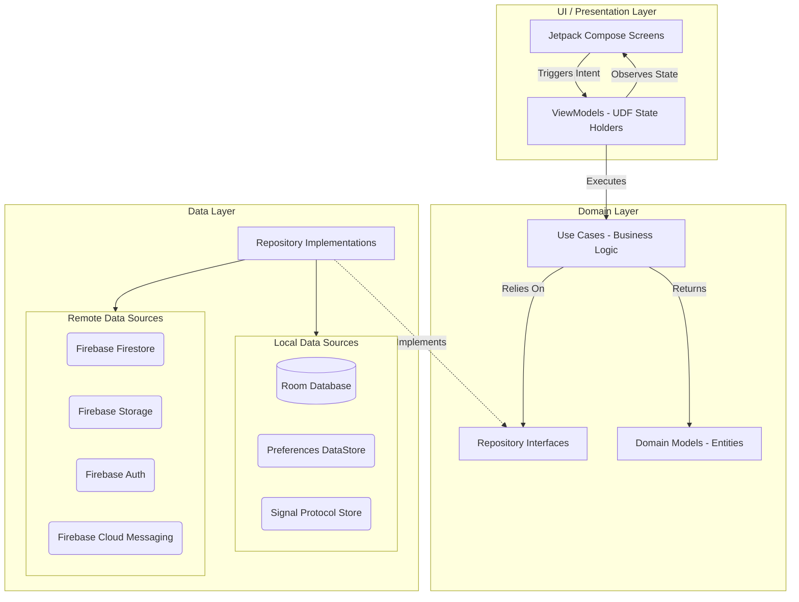
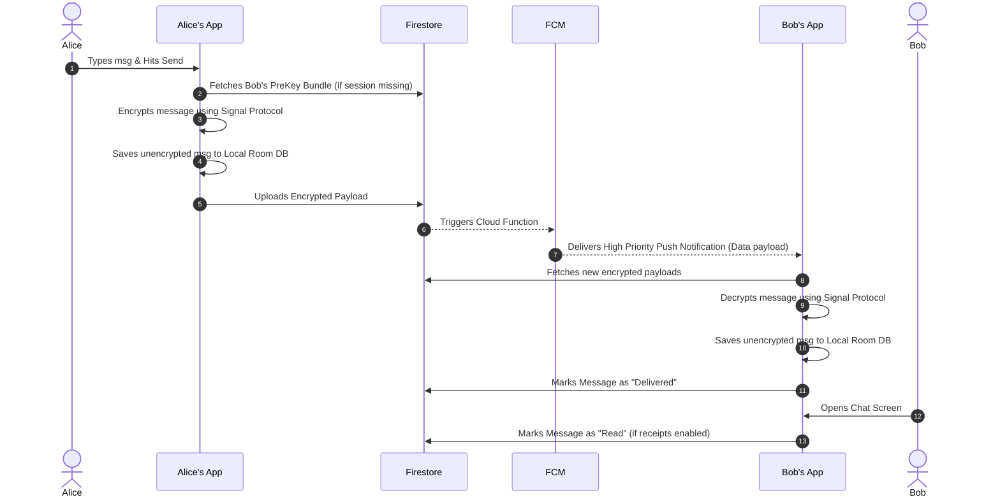
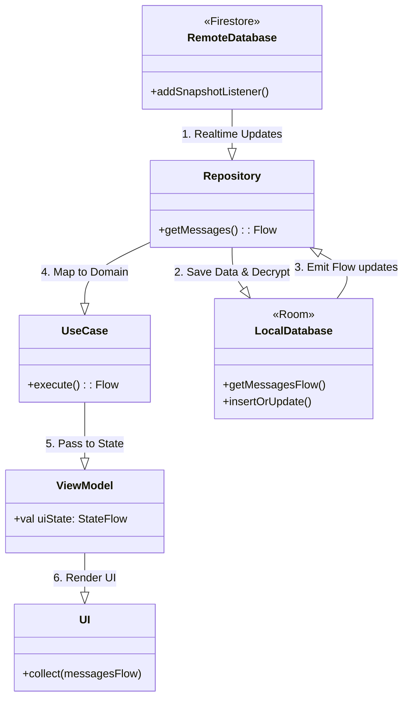
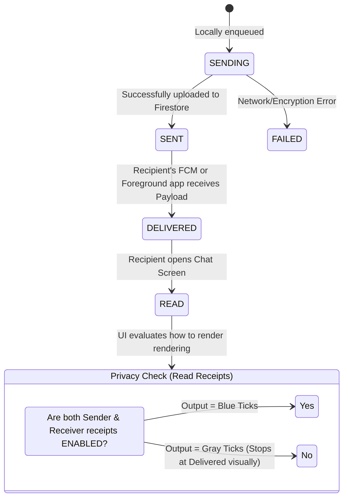
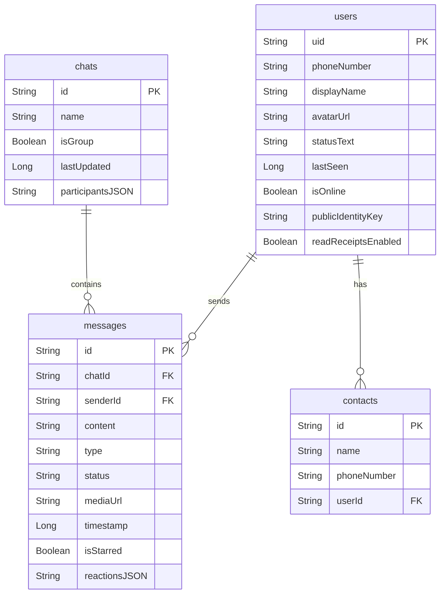

/mode# FireStream Chat Spec and Architecture

This document provides a detailed specification and architectural overview of the **FireStream Chat** application, a real-time messaging Android application built with modern Android development practices, end-to-end encryption, and a robust feature set resembling modern chat apps (e.g., WhatsApp, Signal).

## 1. Specification / Features

### Core Messaging
- **1-on-1 Chat**: Text messaging with real-time syncing.
- **Media Support**: Send and receive images, voice messages, and generic documents. Includes a fullscreen image viewer and voice media player with adjustable playback speed.
- **End-to-End Encryption (E2EE)**: All messages are encrypted natively on the client device using the **Signal Protocol** before transmission.
- **Read Receipts Status**:
  - **Sent** (Single gray tick): Message reached the server.
  - **Delivered** (Double gray tick): Message reached the recipient's device.
  - **Read** (Double blue tick): Recipient opened and viewed the conversation.
  - **Privacy Control**: Users can disable read receipts (Bidirectional enforcement: if disabled by either user, both users see only up to the Delivered status).
- **Typing Indicators**: Real-time "typing..." status.

### Message Interactions
- **Reply**: Swipe-to-reply or long-press context menu to quote/reply to specific messages.
- **React**: Emoji reactions on messages.
- **Forward**: Share messages to other active chats.
- **Star**: Bookmark messages.
- **Edit/Delete**: Edit a previously sent message or delete it entirely for both parties.
- **Message Info**: View exact delivery and read timestamps for participants.
- **Link Previews**: Automatic rich preview card generation for URLs included in messages.

### Organization & User Management
- **Local & Global Search**: Full-text search support to locate messages either within a specific conversation or globally across all chats.
- **Shared Media**: Dedicated screens in User Profile to browse shared images.
- **Online/Last Seen Presence**: Live presence indicating user availability. Privacy controls exist to configure who can view the last seen status.
- **Profile Setup**: Phone-number authentication with profile creation (Display Name, Status Text, Avatar URL).
- **Blocking Mechanism**: Block/unblock users to prevent communication.

---

## 2. Technology Stack

- **Platform**: Android
- **Language**: Kotlin
- **UI Toolkit**: Jetpack Compose
- **Architecture**: Clean Architecture + MVVM (Model-View-ViewModel) + UDF (Unidirectional Data Flow)
- **Dependency Injection**: Dagger Hilt
- **Local Database**: Room (SQLite) with Coroutines Flow for reactive updates
- **Preferences**: Jetpack DataStore (Preferences DataStore)
- **Backend Infrastructure**: Firebase Services
  - **Firestore**: Real-time NoSQL database for syncing encrypted payloads, user statuses, and typing indicators.
  - **Firebase Authentication**: Phone authentication mechanism.
  - **Cloud Storage**: Hosting user avatars, images, and voice recordings.
  - **Cloud Functions**: Server-side triggers (e.g., pushing FCM notifications upon new messages).
  - **Firebase Cloud Messaging (FCM)**: Reliable push notifications for background delivery wake-ups.
- **Cryptography**: `libsignal-android` for industry-standard Signal Protocol end-to-end encryption.
- **Image Loading**: Coil
- **Concurrency**: Kotlin Coroutines & Flow

---

## 3. High-Level Architecture (Clean Architecture)

FireStream strictly adheres to Clean Architecture principles separating responsibilities into three distinct layers: **Domain**, **Data**, and **UI/Presentation**.

### 3.1 Domain Layer
The most isolated layer, containing enterprise-wide and application-specific business logic.
- **Models**: Plain Kotlin Data Classes (e.g., `Message`, `User`, `Chat`). Extracted from framework-specific models (like Room Entities or Firestore Snapshots).
- **Repository Interfaces**: Abstractions (e.g., `MessageRepository`, `UserRepository`) dictating what required data operations are available without knowing *how* they're implemented.
- **Use Cases**: Single-responsibility executors (e.g., `SendMessageUseCase`, `GetMessagesUseCase`) that encapsulate business logic (e.g., encrypting a message *before* delegating to the repository).

### 3.2 Data Layer
The concrete implementation resolving the Repository Interfaces. It serves as the single source of truth (SSOT) via Offline-First syncing mechanisms.
- **Local Sources**: Room DB handles the reactive caching. The app primarily drives the UI from Room via `Flow`.
- **Remote Sources**: Firebase services. The repository layer typically observes Firebase, writes modifications to Room, and the UI reacts to the Room changes.
- **Crypto Sources**: The `SignalManager` and KeyStores orchestrate key generation, pre-key bundles, and encryption/decryption cycles transparently to the upper layers.

### 3.3 UI / Presentation Layer
- **ViewModels**: Maintain view state (`StateFlow` of `UiState` data classes). They handle user intents and translate UI actions into domain use case executions.
- **Jetpack Compose Screens**: Declarative, composable functions rendering UI strictly based on the provided immutable `UiState`.

---

## 4. End-to-End Encryption Flow

The messaging pipeline uses the Signal Protocol. Below is the sequence describing how sending and receiving an encrypted message works.

---

## 5. Offline-First Data Synchronization

The application relies heavily on Room as the **Single Source of Truth**. The UI very rarely reads directly from Firestore; it reads from Room Dao `Flow` streams.

---

## 6. Real-Time Status & Read Receipts Algorithm

Tracking message delivery involves an interplay between Android background services (FCM), foreground composables, and strict privacy logic.

### Status Implementation Details
1. **SENT**: Initial state assigned directly after a successful suspend function call executing `firestore.document(id).set(...)`.
2. **DELIVERED**: The recipient device triggers an acknowledgment update back to Firestore over two vectors:
   - **Background**: The `FCMService` intercepts a background data push, extracts the `messageId`, and updates the Firestore document status to `DELIVERED`.
   - **Foreground**: `ChatListViewModel` or `ChatViewModel` fetches the message from the snapshot listener, processes the payload, and retroactively marks it `DELIVERED`.
3. **READ**: Only updated when the recipient explicitly enters the active `ChatScreen`. `ChatViewModel` checks `PreferencesDataStore` (local setting) and `User` document (remote setting) to ensure both parties consent to Read Receipts via the `readReceiptsEnabled` properties. If true, the status updates to `READ`.

---

## 7. Database Entity Schema (Room)

*Note: The actual DB also contains specialized tables for Signal keys (`SignalSessionEntity`, `SignalPreKeyEntity`, etc.) necessary to preserve the persistent cryptographic state.*
