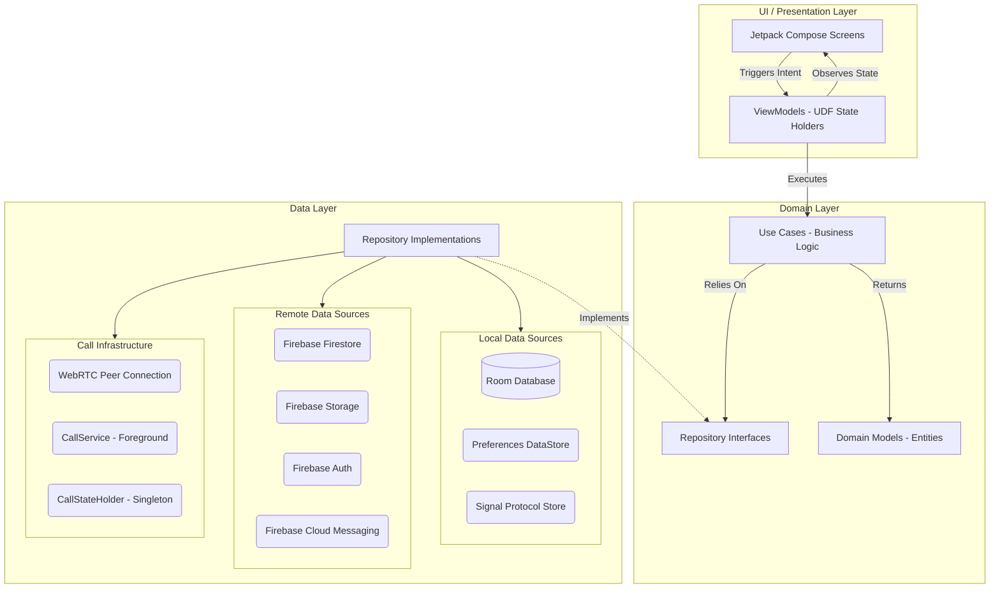
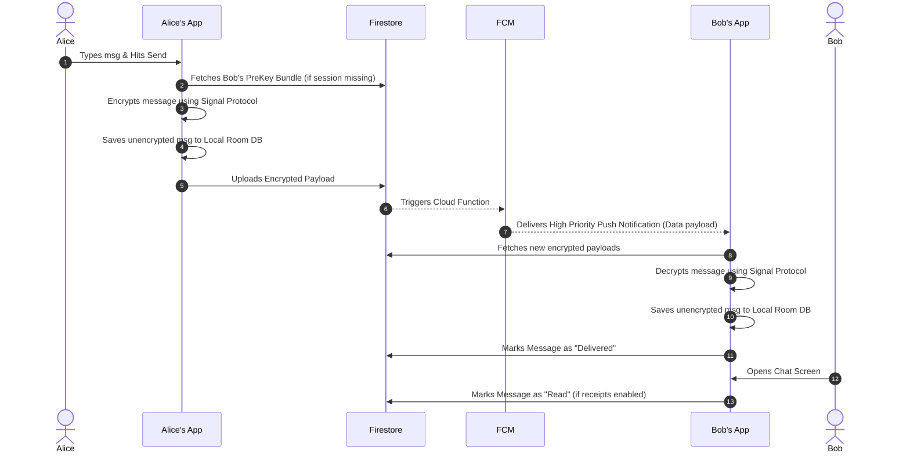
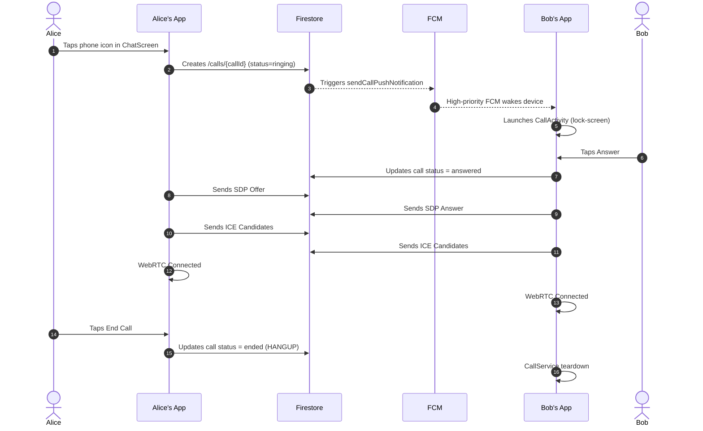
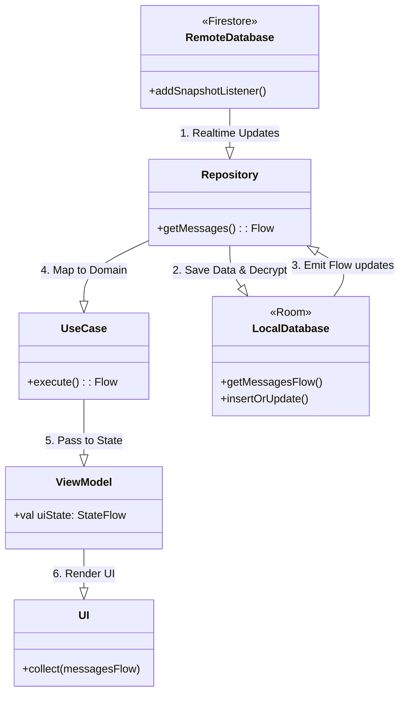
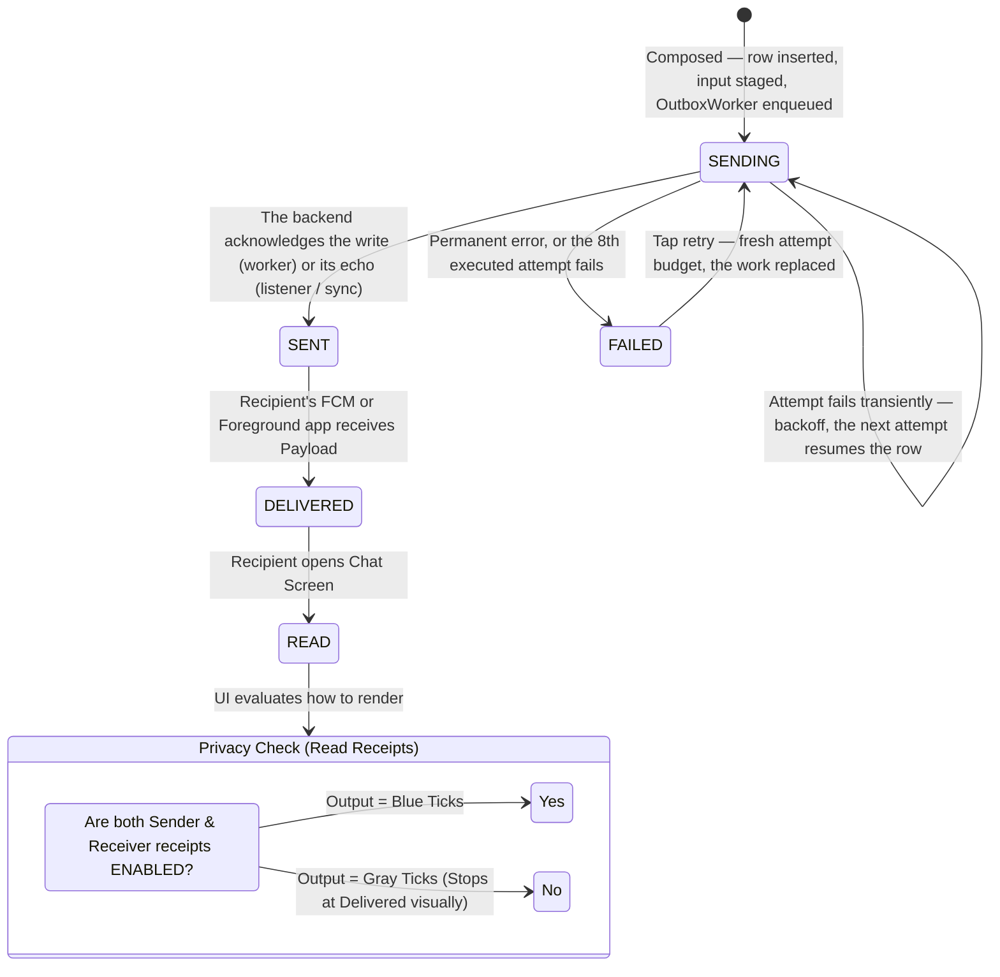
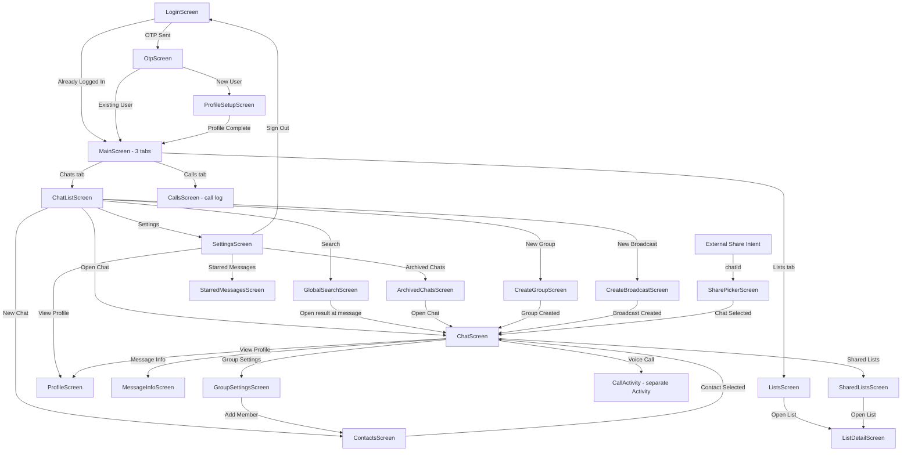

# FireStream Chat Spec and Architecture

This document provides a detailed specification and architectural overview of the **FireStream** application, a real-time messaging Android application built with modern Android development practices, end-to-end encryption, and a robust feature set resembling modern chat apps (e.g., WhatsApp, Signal).

## 1. Specification / Features

Moved — see [SPEC.md](SPEC.md) for the full product feature list.

---

## 2. Technology Stack

- **Platform**: Android
- **Language**: Kotlin
- **UI Toolkit**: Jetpack Compose
- **Architecture**: Clean Architecture + MVVM (Model-View-ViewModel) + UDF (Unidirectional Data Flow)
- **Dependency Injection**: Dagger Hilt
- **Local Database**: Room (SQLite) with Coroutines Flow for reactive updates
- **Preferences**: Jetpack DataStore (Preferences DataStore)
- **Backend Infrastructure**: Firebase Services
  - **Firestore**: Real-time NoSQL database for syncing encrypted payloads, user statuses, typing indicators, and call signaling.
  - **Firebase Authentication**: Phone authentication mechanism.
  - **Cloud Storage**: Hosting user avatars, images, and voice recordings.
  - **Cloud Functions**: Server-side triggers — push notifications on new messages (`sendPushNotification`) and incoming calls (`sendCallPushNotification`) — and one callable, `getTurnCredentials`, which hands a signed-in user the login for the call relay. Runtime: Node.js 20.
  - **Firebase Cloud Messaging (FCM)**: Reliable push notifications for background delivery wake-ups and incoming call alerts.
- **Cryptography**: `libsignal-android` for industry-standard Signal Protocol end-to-end encryption (including post-quantum Kyber pre-keys).
- **Real-Time Communication**: `stream-webrtc-android` for WebRTC-based voice calls.
- **Image Loading**: Coil
- **Concurrency**: Kotlin Coroutines & Flow

---

## 3. High-Level Architecture (Clean Architecture)

FireStream strictly adheres to Clean Architecture principles separating responsibilities into three distinct layers: **Domain**, **Data**, and **UI/Presentation**.


```mermaid
graph TD
    %% Define Layers
    subgraph UI_Layer [UI / Presentation Layer]
        UI[Jetpack Compose Screens]
        VM[ViewModels - UDF State Holders]
    end

    subgraph Domain_Layer [Domain Layer]
        UC[Use Cases - Business Logic]
        repoInt[Repository Interfaces]
        models[Domain Models - Entities]
    end

    subgraph Data_Layer [Data Layer]
        repoImpl[Repository Implementations]

        subgraph Local_Source [Local Data Sources]
            room[(Room Database)]
            dataStore(Preferences DataStore)
            signalStore(Signal Protocol Store)
        end

        subgraph Remote_Source [Remote Data Sources]
            firestore(Firebase Firestore)
            storage(Firebase Storage)
            auth(Firebase Auth)
            fcm(Firebase Cloud Messaging)
        end

        subgraph Call_Source [Call Infrastructure]
            webrtc(WebRTC Peer Connection)
            callService(CallService - Foreground)
            callState(CallStateHolder - Singleton)
        end
    end

    %% Define Relationships
    UI -->|Triggers Intent| VM
    VM -->|Observes State| UI

    VM -->|Executes| UC
    UC -->|Relies On| repoInt
    UC -->|Returns| models

    repoImpl -. Implements .-> repoInt
    repoImpl --> Local_Source
    repoImpl --> Remote_Source
    repoImpl --> Call_Source
```

### 3.1 Domain Layer

The most isolated layer, containing enterprise-wide and application-specific business logic.

- **Models**: Plain Kotlin data classes (`Message`, `User`, `Chat`, `Contact`, `Poll`, `PollOption`, `CallState`, `CallLogEntry`, `CallSignalingData`, `IceCandidateData`, `IceServerData`, `GroupPermissions`, `GroupRole`, `ListData`, `ListItem`, `ListDiff`, `ListHistoryEntry`, `HistoryAction`, `MediaAttachment`, `SharedContent`, `MessageStatus`, `MessageType`, `ChatType`). Extracted from framework-specific models (like Room Entities or Firestore Snapshots).
- **Repository Interfaces**: 8 abstractions (`AuthRepository`, `CallRepository`, `ChatRepository`, `ContactRepository`, `ListRepository`, `MessageRepository`, `PollRepository`, `UserRepository`) dictating what required data operations are available without knowing _how_ they're implemented.
- **Use Cases**: Single-responsibility executors organized into `chat/`, `list/`, and `message/` subdirectories: `CheckGroupPermissionUseCase`, `SendListUpdateToChatsUseCase`, `SearchMessagesUseCase`.

### 3.2 Data Layer

The concrete implementation resolving the Repository Interfaces.

- **Local Sources**: Room handles the reactive caching. The app primarily drives the UI from Room via `Flow`. Two databases live side by side: `AppDatabase` (`fire_stream_chat.db`) for application data and `SignalDatabase` (`signal.db`) for Signal Protocol key material — splitting them means destructive schema migrations on application data cannot wipe cryptographic state.
- **Remote Sources**: Firebase services. The repository layer typically observes Firestore, writes modifications to Room, and the UI reacts to the Room changes.
- **Crypto Sources**: `SignalManager` and `SignalProtocolStoreImpl` orchestrate key generation, pre-key bundles, and encryption/decryption cycles transparently to the upper layers.
- **Media Infrastructure**: `MediaFileManager` (@Singleton) manages local media storage at `filesDir/media/{chatId}/{messageId}.{ext}` and gallery export via MediaStore (`Pictures/FireStream`). `ImageCompressor` (@Singleton) provides EXIF-aware compression with `inSampleSize` for memory-safe decode (1600px/80% JPEG default, full quality opt-in via DataStore). Under the "Keep Original Images" preference `OutboxSender` uploads the encoding but copies the untouched input into the media dir as the message's local file, in one persisted step. `MediaBackfillWorker` (WorkManager) downloads whatever media has no local copy, respecting `AutoDownloadOption` and network constraints — daily as periodic work, on demand from Settings, and as the one-time run `MediaBackfillScheduler` queues when an auto-download fails, so a photo received while offline lands once there is a network again without the chat being opened (the push reconcile, `MessageRepository.reconcileFromPush`, is what gets such a message into Room in the first place).
- **Call Infrastructure**: `CallService` (foreground service) holds one call at a time and runs it in a `CallSession`. `WebRtcCallLocalMedia` owns the call's WebRTC objects: the microphone, the camera, and one `PeerSession` per remote person, each with its own peer connection. `CallStateHolder` (@Singleton) bridges the service to the UI via `StateFlow`. `CallActivity` is a separate Android Activity (not a NavHost destination) for lock-screen support.

### 3.3 UI / Presentation Layer

- **ViewModels**: Maintain view state (`StateFlow` of `UiState` data classes). Handle user intents and translate UI actions into domain use case executions.
- **Jetpack Compose Screens**: Declarative, composable functions rendering UI strictly based on the provided immutable `UiState`.
- **ChatScreen** is split into 22 focused files (`MessageBubble`, `VoiceMessagePlayer`, `LinkPreviewCard`, `FullscreenImageViewer`, `ImagePreviewScreen`, `ForwardMessagePanel`, `EmojiHandlerPanel`, `EmojiSearchData`, `PollBubble`, `CreatePollSheet`, `ListBubble`, `CreateListSheet`, `ChatUtils`, `MessageInfoScreen`, `ChatScreen`, `ChatViewModel`, plus 6 manager classes — `ChatPollManager`, `ChatSearchManager`, `ChatMessageActions`, `ChatMessageSender`, `ChatMessageLoader`, `ChatInfoManager`), all with `internal` visibility. `ChatViewModel` is a thin orchestrator (~220 lines) that constructs and delegates to the 6 managers; all managers share a single `MutableStateFlow<ChatUiState>` reference. The search-results and filter-chip rendering lives in `ui/search/` instead, because global search renders the same way.
- **Bottom navigation**: `MainScreen` (`ui/main/`) hosts a `HorizontalPager` with three tabs — Chats, Calls, and Lists. `BottomNavBar` and the swipe gesture live exclusively in `MainScreen`; individual tab screens (`ChatListScreen`, `CallsScreen`, `ListsScreen`) do **not** own the nav bar. The `CHAT_LIST` NavHost route renders `MainScreen`; the Calls and Lists tabs are internal pager state, not NavHost destinations.

---

## 4. End-to-End Encryption Flow

The messaging pipeline uses the Signal Protocol. Below is the sequence describing how sending and receiving an encrypted message works.


```mermaid
sequenceDiagram
    autonumber
    actor Alice
    participant App_A as Alice's App
    participant Firestore
    participant FCM
    participant App_B as Bob's App
    actor Bob

    Alice->>App_A: Types msg & Hits Send
    App_A->>Firestore: Fetches Bob's PreKey Bundle (if session missing)
    App_A->>App_A: Encrypts message using Signal Protocol
    App_A->>App_A: Saves unencrypted msg to Local Room DB
    App_A->>Firestore: Uploads Encrypted Payload

    Firestore-->>FCM: Triggers Cloud Function
    FCM-->>App_B: Delivers High Priority Push Notification (Data payload)

    App_B->>Firestore: Fetches new encrypted payloads
    App_B->>App_B: Decrypts message using Signal Protocol
    App_B->>App_B: Saves unencrypted msg to Local Room DB
    App_B->>Firestore: Marks Message as "Delivered"

    Bob->>App_B: Opens Chat Screen
    App_B->>Firestore: Marks Message as "Read" (if receipts enabled)
```

> **Debug builds**: Encryption is bypassed — `MessageRepositoryImpl` calls `sendPlainMessage()` instead of the encrypted path, avoiding key-loss issues during development.
>
> **Release builds**: Users may opt out of Signal end-to-end encryption from Settings → Privacy. The flag is read from `PreferencesDataStore.e2eEncryptionEnabledFlow` (default `true`) and gates the same `sendPlainMessage()` branch.

---

## 5. Voice Call Signaling Flow

Voice calls use WebRTC for media and Firestore for signaling.


```mermaid
sequenceDiagram
    autonumber
    actor Alice
    participant App_A as Alice's App
    participant Firestore
    participant FCM
    participant App_B as Bob's App
    actor Bob

    Alice->>App_A: Taps phone icon in ChatScreen
    App_A->>Firestore: Creates /calls/{callId} (status=ringing)
    Firestore-->>FCM: Triggers sendCallPushNotification
    FCM-->>App_B: High-priority FCM wakes device

    App_B->>App_B: Launches CallActivity (lock-screen)
    Bob->>App_B: Taps Answer
    App_B->>Firestore: Updates call status = answered

    App_A->>Firestore: Sends SDP Offer
    App_B->>Firestore: Sends SDP Answer
    App_A->>Firestore: Sends ICE Candidates
    App_B->>Firestore: Sends ICE Candidates

    App_A->>App_A: WebRTC Connected
    App_B->>App_B: WebRTC Connected

    Alice->>App_A: Taps End Call
    App_A->>Firestore: Updates call status = ended (HANGUP)
    App_B->>App_B: CallService teardown
```

### Call Architecture Details

- **`CallService`** (foreground service): The Android side of a call: the foreground type and its notification, the audio session, and the permissions. It holds one `CallSession` at a time, passes it the user's actions, and stops with the latest start id. It holds no call logic.
- **`CallSession`**: One call, without Android or WebRTC: its states, its ring, its timer (ringing, connecting, a lost connection), the status of the call document, the end reason and the call's chat message. It also owns the call's kind, the camera switch, and what this side says about itself on the call document. It reaches Android through `CallHost` and the WebRTC objects through `CallLocalMedia`, so `CallSessionTest` drives it on the JVM.
- **Threading**: A call's state is confined to the main thread. `CallService`, `CallSession` and `CameraSwitch` run there, and `WebRtcCallLocalMedia` brings every callback there, so none of them holds a lock. Two things leave the main thread, because they wait for the camera thread: the camera's device calls, and the release of a finished call's camera, tracks and factory. Both run one at a time on one worker. `PeerSession` keeps its own locks, because WebRTC calls it on the signalling thread.
- **`CallLocalMedia`** / **`WebRtcCallLocalMedia`**: The WebRTC objects of one call: the factory, the microphone track, the camera, and one `PeerSession` per remote person. `openPeer` starts a session and hands back its events. One microphone track and one camera track go into every session. It feeds `CallVideoSinks` with the own and the remote video tracks.
- **`PeerSession`**: Owns one `PeerConnection` to one remote person. It negotiates the offer and answer, holds remote ICE candidates until the remote description is set, and drops duplicates. It reports connected, disconnected, failed, remote-track and video-line events through a channel, which `CallSession` collects on the main thread. Releasing a connection waits for the WebRTC signalling thread, so a session is never closed from inside one of its own callbacks. `close()` disposes the connection. On connect it logs whether the path is direct or relayed (`IcePath`), and through which server when this side's end is the relay.
- **Who sequences what**: The session answers the offer, applies the answer once, and writes its answer together with `answered`. `CallSession` reads the call document once before it answers and closes the call when it is no longer `ringing`. It then hands the offer it read to `OneToOneSignaling`. A call that does not connect within 30 s of the answer ends as an error, and so does a connection that stays lost for 30 s.
- **The relay** (`IceServerProvider`, @Singleton): A connection is built with the servers this class hands out. They come from the `getTurnCredentials` function, which returns Cloudflare's STUN and TURN URLs and a login that is good for a day. The provider keeps a set for twelve hours. A caller waits at most three seconds and then gets public STUN servers alone, as it does after a failed fetch. The fetch runs on the application scope, so a caller that stops waiting does not cancel it. Nothing may wait between the ring and the offer, so the side that calls waits inside `CallRepository.createCall`, before the call document exists, and `CallSession` then takes the kept set with `current()`. The side that answers fetches while it rings, and waits with `get()` before it opens its connection, which returns at once when the fetch has settled. `CallActivity` starts the fetch when it opens (`CallRepository.prepareCall`). The pocketbase flavor has no relay.
- **`PeerSignaling`**: What a session needs for one pair: send and observe the offer, the answer and the candidates. `OneToOneSignaling` implements it over `CallRepository` and maps caller and callee to the two candidate subcollections.
- **`CallStateHolder`** (@Singleton): Exposes `StateFlow<CallState>`, `StateFlow<CallUiControls>` (the own side), `StateFlow<List<CallParticipant>>` (the other people), the call's chat and the surfaces that show it. Bridges `CallService` ↔ UI without binding to the service. A call starts with fresh controls: `startPlacing()` for a call this phone places, `beginCall()` when the session takes a call.
- **Placing a call**: `CallViewModel.placeCall` publishes `CallState.Placing`, creates the call through `CallRepository.createCall(calleeId, video)`, and starts `CallService` with the call's kind and with `OutgoingCall.videoLine`. `CallSession.startOutgoing` takes the placing over with `takeOverPlacing`. A Cancel or a closed screen ends the placing at any stage, and whoever ends a placing whose document exists also ends the call and records it.
- **The video line**: A call between two apps with video negotiates one video line, in both directions, with the offer and the answer. The side that offers adds a `SEND_RECV` transceiver, and the side that answers sets the offered one to `SEND_RECV`. `PeerSession.setCamera(track)` puts the camera track on the line or takes it off, and no new offer is needed. `videoAvailable` is true when the negotiated direction is `SEND_RECV`.
- **Who is offered the video line**: An app from before video calls crashes on an offer with a video line. An app with video therefore writes `callVideoLine: true` to its user document when it starts, when an existing user signs in, and when it creates a new user document. `CallRepository.createCall` reads the callee's field before it creates the call document and returns it as `OutgoingCall.videoLine`. A missing field, a failed read and a read that takes over three seconds all mean no video line. `CallSession` passes the answer on to `PeerSession(offerVideoLine)`. Without the line the call runs as a voice call and `CallUiControls.videoAvailable` is false. An app from before video calls that places a call offers no line, so the side that answers needs no check.
- **`LocalCamera`**: The call's own camera, front first, 1280×720 at 30 fps. It needs only the factory, so it can run as a preview while the call rings. `stop()` closes the camera device. It is never called on the main thread.
- **The camera follows the screen** (`CameraSwitch`): The camera runs while the user switched it on (`ACTION_SET_CAMERA`) and the call is on screen (`CallStateHolder.onScreen`). It goes on only with the `CAMERA` permission, which the service never asks for, and only in a call with an agreed video line. While the camera is switched on, the foreground type is `microphone|camera`. A type the system refuses leaves the camera off and the call running. `CameraSwitch` is a plain class with its own test.
- **Live state** (`CallMediaPublisher`): Each side writes `media.<uid>` (`camera`, `mic`) on the call document, on connect and on every change, through one collector. It writes only in a call whose video line both sides agreed on. An app from before video calls that placed the call applies the answer again on every change of an answered call document, and ends the call when that fails. The other side's entry and the first frame of their video fill `CallParticipant` (`cameraOn`, `micOn`, `hasFrame`). These writes make an answered call emit many snapshots, so every reaction of `CallSession` to the document's status is safe to repeat.
- **`CallVideoSinks`** (@Singleton): The only place where a video track meets a `View`. `createView(context, participantId)` returns a view that follows that participant's track, and `LOCAL` is the own camera, mirrored for the front camera. A participant can have several views. `WebRtcCallLocalMedia` closes it before a track or a connection is disposed.
- **Release order**: `WebRtcCallLocalMedia.dispose()` takes the views off every track, silences the microphone, takes the camera track off the connections and closes them, all at once on the main thread. The call is then silent and the microphone free before `CallSession` hands the audio session back. The rest goes on the worker, because the camera waits for its own thread: capturer, texture helper, video source, tracks, factory, EGL context. Each step is guarded. The factory is left alone when a step before it failed.
- **The fallback ring**: When Android will not let a push start the call service, `FCMService` rings with a notification instead. It names the call's kind, opens `CallActivity` with `ACTION_RING`, which starts the service from the foreground, and its Decline declines the call without a session.
- **`CallActivity`** (separate Activity): Not a NavHost route. Launched via Intent. Supports lock-screen rendering. `callLaunchFor` decides what an intent asks for, so a relaunch from Recents never places or answers a call again. A permission prompt's pending action lives in `CallViewModel`, so a rotation does not lose it.
- **Two activities draw one call**: `CallActivity` draws the stage, full screen, in its own task. `MainActivity` draws the docked card (`DockedCall` in `ui/call/DockedCallCard.kt`) at the top of the call's chat. Both read `CallStateHolder` through a `CallViewModel` and make their own video views with `CallVideoSinks`.
  - *Docking*: the stage's arrow, the back button and a swipe up open the chat through `MainActivity`'s deep link and move the stage's task to the back. The link carries `EXTRA_KEEP_PLACE`, so a chat that is still open keeps its place in the thread (`warmDeepLinkAction` in `NavGraph.kt`). The card's *Full screen* button, or a pull down, starts `CallActivity.stageIntent`.
  - *The call's chat*: `CallStateHolder.chatId`. The caller has it from the start. The side that answers looks it up with `ChatRepository.getOrCreateChat` after the answer.
  - *Where the card shows*: `docksIn` is the rule. The card shows only in the call's own chat. An incoming ring has no card. The card is gone while the stage or its picture-in-picture window is on screen.
  - *Visibility*: each surface reports itself as a `CallSurface` (`STAGE`, `DOCK`) to `CallStateHolder` while it is started. `onScreen` is true while any surface shows and turns false one second after the last one left, so the hand-over does not pause the camera. `CallSession` collects it, and starts the preview of a video ring with the first surface that shows the call.
  - *The end*: a call that ends while docked shows *Call ended* on the card for a moment, and `CallActivity` finishes in the background (`closesUnseen`).
- **`CallState`** (sealed interface): `Idle | Placing | OutgoingRinging | IncomingRinging | Connecting | Connected | Ended(EndReason)`. `Placing` covers an outgoing call from the moment its setup starts, after the permission prompt, until the service takes it over. It counts as ongoing, carries how the call was started, and cannot dock.
- **Audio session** (`startAudioSession()` / `stopAudioSession()` in `CallService`, idempotent and
  mutually exclusive): sets `MODE_IN_COMMUNICATION`, then `CallAudioRouter` picks the route through
  `AudioManager.setCommunicationDevice()`. `CallAudioRoutePolicy` is the pure decision (a headset
  appearing mid-call wins; a disconnect falls back to the earpiece, never the speaker); the router
  publishes what the OS *actually* reports, so the UI never shows Bluetooth before SCO is up.
  `ProximityLock` follows that reported route — the screen blanks only while the earpiece is playing.
  Audio follows video: a call started as video, or one where video shows on either side, plays on
  the speaker unless a headset is connected or the user picked a route, and takes no proximity lock
  while video shows.

---

## 6. Offline-First Data Synchronization

The application relies heavily on Room as the **Single Source of Truth**. The UI very rarely reads directly from Firestore; it reads from Room Dao `Flow` streams.


```mermaid
classDiagram
    class UI {
        +collect(messagesFlow)
    }
    class ViewModel {
        +val uiState: StateFlow
    }
    class UseCase {
        +execute(): Flow
    }
    class Repository {
        +getMessages(): Flow
    }
    class LocalDatabase {
        <<Room>>
        +getMessagesFlow()
        +insertOrUpdate()
    }
    class RemoteDatabase {
        <<Firestore>>
        +addSnapshotListener()
    }

    RemoteDatabase --|> Repository : 1. Realtime Updates
    Repository --|> LocalDatabase : 2. Save Data & Decrypt
    LocalDatabase --|> Repository : 3. Emit Flow updates
    Repository --|> UseCase : 4. Map to Domain
    UseCase --|> ViewModel : 5. Pass to State
    ViewModel --|> UI : 6. Render UI
```

---

## 7. Real-Time Status & Read Receipts Algorithm

Tracking message delivery involves an interplay between Android background services (FCM), foreground composables, and strict privacy logic.


```mermaid
stateDiagram-v2
    [*] --> SENDING : Composed — row inserted, input staged, OutboxWorker enqueued
    SENDING --> SENDING : Attempt fails transiently — backoff, the next attempt resumes the row
    SENDING --> SENT : The backend acknowledges the write (worker) or its echo (listener / sync)
    SENDING --> FAILED : Permanent error, or the 8th executed attempt fails
    FAILED --> SENDING : Tap retry — fresh attempt budget, the work replaced

    SENT --> DELIVERED : Recipient's FCM or Foreground app receives Payload
    DELIVERED --> READ : Recipient opens Chat Screen

    state "Privacy Check (Read Receipts)" as PrivacyCheck {
        direction LR
        Check: Are both Sender & Receiver receipts ENABLED?
        Check --> Yes: Output = Blue Ticks
        Check --> No: Output = Gray Ticks (Stops at Delivered visually)
    }

    READ --> PrivacyCheck : UI evaluates how to render
```

### Status Implementation Details

1. **SENDING**: The optimistic row, from compose until the backend acknowledges it — queued or in flight alike. Delivered by `OutboxWorker`, one unique WorkManager job per message, online by constraint (see the *Offline Outbox* section of [FEATURE-MAP.md](FEATURE-MAP.md) and the pattern in [PATTERNS.md](PATTERNS.md#sends-are-idempotent-by-client-id-and-drained-by-outboxworker)).
1. **SENT**: Assigned once `firestore.document(id).set(...)` — or, on a re-attempt, the flush-then-create-if-absent transaction — is acknowledged, or once the listener sees an acknowledged echo of the write (`MessageDao.markSent` / `acknowledge`).
2. **DELIVERED**: Triggered via two vectors:
   - **Background**: `FCMService` intercepts a data push, extracts `messageId`, and updates Firestore status to `DELIVERED`.
   - **Foreground**: `ChatListViewModel` or `ChatViewModel` processes the Firestore snapshot and marks pending messages as `DELIVERED`.
3. **READ**: Updated when the recipient enters `ChatScreen`. `ChatViewModel` checks `PreferencesDataStore` (local) and the `User` document (remote) to confirm both parties consent via `readReceiptsEnabled`. Read receipts are always hidden for `BROADCAST` chats.
4. **Group tracking**: `readBy: Map<String, Long>` and `deliveredTo: Map<String, Long>` track per-recipient timestamps for group messages.

---

## 8. Database Entity Schema (Room)

Moved — see [SCHEMA-ROOM.md](SCHEMA-ROOM.md) for the full Room ER diagram and table listing.

---

## 9. Firestore & Realtime Database Schema

Moved — see [SCHEMA-FIRESTORE.md](SCHEMA-FIRESTORE.md) for Firestore collections, RTDB paths, and key patterns.

---

## 10. Domain Models

Moved — see [DOMAIN-MODELS.md](DOMAIN-MODELS.md) for the Kotlin data classes.

---

## 11. Screen Navigation Architecture

The application uses a single `NavHost` in `MainActivity` for all routes except `CallActivity`, which is launched via Intent for lock-screen support. The `CHAT_LIST` route renders `MainScreen`, which hosts a `HorizontalPager` with Chats, Calls, and Lists tabs — the Calls and Lists tabs are internal pager state, not NavHost routes.


```mermaid
graph TD
    %% Auth Flow
    Login[LoginScreen] -->|Already Logged In| Main[MainScreen - 3 tabs]
    Login -->|OTP Sent| Otp[OtpScreen]
    Otp -->|Existing User| Main
    Otp -->|New User| ProfileSetup[ProfileSetupScreen]
    ProfileSetup -->|Profile Complete| Main
    Settings[SettingsScreen] -->|Sign Out| Login

    %% Main Tabs (internal pager state)
    Main -->|Chats tab| ChatList[ChatListScreen]
    Main -->|Calls tab| CallsLog[CallsScreen - call log]
    Main -->|Lists tab| Lists[ListsScreen]

    %% From ChatList
    ChatList -->|Settings| Settings
    ChatList -->|New Chat| Contacts[ContactsScreen]
    ChatList -->|New Group| CreateGroup[CreateGroupScreen]
    ChatList -->|New Broadcast| CreateBroadcast[CreateBroadcastScreen]
    ChatList -->|Open Chat| Chat[ChatScreen]
    ChatList -->|Search| Search[GlobalSearchScreen]
    Search -->|Open result at message| Chat

    %% From Settings
    Settings -->|Starred Messages| StarredMessages[StarredMessagesScreen]
    Settings -->|Archived Chats| ArchivedChats[ArchivedChatsScreen]
    Settings -->|View Profile| Profile[ProfileScreen]

    %% From Archived Chats
    ArchivedChats -->|Open Chat| Chat

    %% Chat Connective Flows
    Contacts -->|Contact Selected| Chat
    CreateGroup -->|Group Created| Chat
    CreateBroadcast -->|Broadcast Created| Chat

    Chat -->|Message Info| MessageInfo[MessageInfoScreen]
    Chat -->|View Profile| Profile
    Chat -->|Group Settings| GroupSettings[GroupSettingsScreen]
    Chat -->|Voice Call| CallActivity[CallActivity - separate Activity]
    Chat -->|Shared Lists| SharedLists[SharedListsScreen]

    GroupSettings -->|Add Member| Contacts

    %% Lists flows
    Lists -->|Open List| ListDetail[ListDetailScreen]
    SharedLists -->|Open List| ListDetail

    %% Share Intent
    ShareIntent[External Share Intent] -->|chatId| SharePicker[SharePickerScreen]
    SharePicker -->|Chat Selected| Chat
```

### Navigation Routes

| Route              | Arguments                    | Description                        |
| ------------------ | ---------------------------- | ---------------------------------- |
| `LOGIN`            | —                            | Phone number entry                 |
| `OTP`              | verificationId, phoneNumber  | OTP verification                   |
| `PROFILE_SETUP`    | —                            | Initial profile creation           |
| `CHAT_LIST`        | —                            | Main screen (renders `MainScreen`) |
| `CHAT`             | chatId, partnerIdHint        | Chat conversation                  |
| `CONTACTS`         | —                            | Contact list for new chat          |
| `MESSAGE_INFO`     | messageId, chatId            | Delivery/read timestamps           |
| `SETTINGS`         | —                            | App settings                       |
| `USER_PROFILE`     | userId                       | User profile view                  |
| `STARRED_MESSAGES` | —                            | Bookmarked messages                |
| `ARCHIVED_CHATS`   | —                            | Archived conversations             |
| `GROUP_SETTINGS`   | chatId                       | Group admin screen                 |
| `CREATE_GROUP`     | —                            | Group creation                     |
| `CREATE_BROADCAST` | —                            | Broadcast list creation            |
| `SHARE_PICKER`     | —                            | External share target              |
| `LIST_DETAIL`      | listId, autoFocus            | List editing / detail view         |
| `SHARED_LISTS`     | chatId                       | Lists shared into a specific chat  |

---

## 12. Package Layout

```
com.firestream.chat/
├── data/
│   ├── call/                    # WebRTC infrastructure
│   │   ├── CallService.kt       # Foreground service — Android side of a call, one CallSession at a time
│   │   ├── CallSession.kt       # One call's transitions, timer and end-of-call writes (JVM-testable)
│   │   ├── CallHost.kt          # What a CallSession needs from Android
│   │   ├── CallLocalMedia.kt    # One call's microphone, camera and connections as the session sees them
│   │   ├── WebRtcCallLocalMedia.kt  # CallLocalMedia over WebRTC — factory, tracks, PeerSessions, release order
│   │   ├── CameraSwitch.kt      # Pure — whether the own camera runs: switch, permission, video line, screen, foreground type
│   │   ├── PeerSession.kt       # One PeerConnection to one remote person
│   │   ├── PeerSignaling.kt     # Offer/answer/candidates for one pair + OneToOneSignaling
│   │   ├── IcePath.kt           # Pure — direct or relayed, from the selected candidate pair
│   │   ├── IceServerProvider.kt # @Singleton — the relay's servers: kept 12 h, a 3 s wait, STUN only on failure
│   │   ├── LocalCamera.kt       # The call's own camera — start, stop, flip, release order
│   │   ├── CallVideoSinks.kt    # @Singleton — one video View per participant, first frames
│   │   ├── CallMediaPublisher.kt  # Own camera/mic state on the call document, only with an agreed video line
│   │   ├── CallStateHolder.kt   # @Singleton state bridge (service ↔ UI)
│   │   ├── CallNotificationManager.kt
│   │   ├── CallAudioRoutePolicy.kt  # Pure — which route wins, TYPE_* → CallAudioRoute
│   │   ├── CallAudioRouter.kt   # setCommunicationDevice() wrapper + live RouteState
│   │   ├── ProximityLock.kt     # Wake lock held only while the earpiece is playing and no video shows
│   │   └── WebRtcPeerConnectionFactory.kt  # Factory, video codecs and the call's EGL context
│   ├── crypto/
│   │   ├── SignalManager.kt
│   │   └── SignalProtocolStoreImpl.kt
│   ├── local/
│   │   ├── dao/                 # ChatDao, ContactDao, ListDao, MessageDao, ReminderDao, SignalDao, StickerDao, UserDao
│   │   ├── entity/              # Chat, Contact, List, Message + its embedded MessageRecord, Reminder, User,
│   │   │                        # Sticker + StickerPack + StickerPackItem, 6 Signal entities + SignalTrustedIdentity
│   │   ├── AppDatabase.kt       # fire_stream_chat.db — application data
│   │   ├── SignalDatabase.kt    # signal.db — Signal Protocol key material (split from AppDatabase)
│   │   ├── Converters.kt
│   │   └── PreferencesDataStore.kt
│   ├── outbox/
│   │   ├── OutboxScheduler.kt   # One unique WorkManager job per queued message; requeueAll on start
│   │   ├── OutboxSender.kt      # The attempt's pipeline: resume, upload, encrypt once, write, SENT
│   │   ├── OutboxJob.kt         # What a row is queued for (send / tombstone / nothing)
│   │   ├── OutboxFiles.kt       # Staged send inputs under filesDir/outbox/
│   │   ├── BlockCheck.kt        # The cached per-peer block-list read in front of a send
│   │   ├── MessageWriter.kt     # Encrypt-or-plaintext decision + the MessageSource write
│   │   ├── SendTarget.kt        # Peer / NoPeer: resolved from the chat row (forChat), read back from outboxRecipientId
│   │   └── SendClock.kt         # Strictly increasing send timestamps
│   ├── sticker/
│   │   ├── StickerFiles.kt      # filesDir/stickers/<sha256>.<ext>; size, format and dimension checks before a file lands
│   │   ├── StickerDownloads.kt  # A sticker's local copy: fetched once, hashed against its id, stored with its row
│   │   ├── StickerUploads.kt    # A sticker's shared object: one lock per sticker, uploaded once, remoteUrl kept on the row
│   │   ├── StickerManifest.kt   # Library rows ⇄ pack manifest; what of a manifest is let into the library
│   │   ├── StickerLibrarySync.kt # The restore: a listener on the user's own manifests, merged newer-only; the sign-out fence
│   │   ├── StickerPackArchive.kt # .wastickers / zip reader under entry, per-entry and total-byte caps
│   │   ├── StickerText.kt       # The one cleaning rule for pack names, publishers and pack ids
│   │   ├── WaStickerMetadata.kt # Pack id, name, publisher and emojis out of a WebP's EXIF chunk
│   │   └── WhatsAppStickerFolder.kt # One child-documents query over the granted WhatsApp sticker folder
│   ├── util/
│   │   ├── AndroidConnectivityObserver.kt # Default-network callback; validated-only, so a captive portal is offline
│   │   ├── ImageCompressor.kt   # EXIF-aware compression, memory-safe decode
│   │   ├── KeyedMutex.kt        # One lock per key, dropped when unused
│   │   ├── MediaFileManager.kt  # Local media storage & gallery export
│   │   ├── ProfileImageManager.kt # Avatar download/cache management
│   │   ├── SpeechRecognizerManager.kt # System SpeechRecognizer wrapper for composer dictation
│   │   ├── ApkDownloader.kt     # Streaming APK download + SHA-256 verification (in-app updater)
│   │   ├── ApkInstaller.kt      # FileProvider + ACTION_VIEW system-installer hand-off
│   │   ├── ResultExt.kt         # Result extension helpers
│   │   └── CurrentActivityHolder.kt
│   ├── worker/
│   │   ├── OutboxWorker.kt        # One delivery attempt per queued message (offline outbox)
│   │   ├── WorkerForeground.kt    # Shared foreground promotion + data-sync ForegroundInfo
│   │   ├── MediaBackfillWorker.kt # WorkManager job to backfill local media
│   │   ├── MediaBackfillScheduler.kt # The one-time backfill run a failed download queues
│   │   ├── StickerSyncWorker.kt   # Backs up changed sticker packs and deletes the manifests of deleted ones
│   │   ├── StickerSyncScheduler.kt # The one unique sync run, queued whenever a pack is unsynced
│   │   └── UpdateCheckWorker.kt   # 24h periodic check; notifies on new release
│   ├── remote/
│   │   ├── fcm/                 # FCMService, ActiveChatTracker
│   │   ├── firebase/            # FirebaseAuthSource, FirestoreChatSource,
│   │   │                        # FirestoreCallSource, FirestoreListSource,
│   │   │                        # FirestoreListHistorySource, FirestoreMessageSource,
│   │   │                        # FirestoreUserSource, FirebaseKeySource,
│   │   │                        # FirebaseStorageSource, RealtimePresenceSource,
│   │   │                        # LinkPreviewSource, FirebaseStickerObjectSource,
│   │   │                        # FirestoreStickerPackSource
│   │   ├── update/              # UpdateManifestSource — fetches latest-{flavor}.json
│   │   └── WebPagePreviewCapture.kt # Off-screen WebView screenshot fallback
│   ├── repository/              # AuthRepositoryImpl, CallRepositoryImpl,
│   │                            # ChatRepositoryImpl, ContactRepositoryImpl,
│   │                            # ListRepositoryImpl, MessageRepositoryImpl,
│   │                            # PollRepositoryImpl, PollMapper, StickerRepositoryImpl,
│   │                            # UserRepositoryImpl, AppUpdateRepositoryImpl
│   └── share/
│       ├── SharedContentHolder.kt
│       └── ShareContentResolver.kt
├── di/                          # AppModule, DatabaseModule, CryptoModule, NetworkModule, SystemModule
├── domain/
│   ├── model/                   # Chat, Message, User, Contact, Poll, PollOption,
│   │                            # CallState, CallLogEntry, CallSignalingData, SdpData,
│   │                            # IceCandidateData, IceServerData, GroupPermissions, GroupRole,
│   │                            # ListData, ListItem, ListDiff, ListType, GenericListStyle,
│   │                            # ListHistoryEntry, HistoryAction, MediaAttachment,
│   │                            # SharedContent, MessageStatus, MessageType, ChatType,
│   │                            # AppUpdate, UpdateCheckResult, Sticker, StickerFormat,
│   │                            # StickerPack, StickerPackKind, StickerImportResult, WhatsAppStickerFile
│   ├── repository/              # AuthRepository, CallRepository, ChatRepository, ContactRepository,
│   │                            # ListRepository, MessageRepository, PollRepository, UserRepository,
│   │                            # AppUpdateRepository, StickerRepository
│   ├── usecase/
│   │   ├── chat/                # CheckGroupPermissionUseCase
│   │   ├── list/                # SendListUpdateToChatsUseCase
│   │   └── message/             # SearchMessagesUseCase
│   └── util/
│       ├── MentionParser.kt
│       ├── WebpContainer.kt     # Pure RIFF chunk walk: dimensions, the animation flag, the raw EXIF chunk
│       └── ConnectivityObserver.kt # Validated-network StateFlow — display only, never the send path
├── navigation/NavGraph.kt
├── ui/
│   ├── auth/                    # Login, Otp, ProfileSetup, AuthViewModel
│   ├── broadcast/               # CreateBroadcastScreen, CreateBroadcastViewModel
│   ├── call/                    # CallActivity, CallScreen, CallViewModel, CallControlButton,
│   │                            # CallAudioRouteSheet (route button + picker sheet)
│   ├── calls/                   # CallsScreen, CallsViewModel (call log tab)
│   ├── chat/                    # ChatScreen, ChatViewModel (orchestrator),
│   │                            # ChatPollManager, ChatSearchManager, ChatMessageActions,
│   │                            # ChatMessageSender, ChatMessageLoader, ChatInfoManager,
│   │                            # ChatDictationManager, DictationControlBar, TypingRow,
│   │                            # MessageBubble, VoiceMessagePlayer, LinkPreviewCard,
│   │                            # FullscreenImageViewer, ImagePreviewScreen,
│   │                            # ZoomableBox, PendingMedia,
│   │                            # ForwardMessagePanel, LocationPickerSheet,
│   │                            # EmojiHandlerPanel, EmojiSearchData, SwipeReactionPanel,
│   │                            # PollBubble, CreatePollSheet, ListBubble, CreateListSheet,
│   │                            # MessageInfoScreen, ChatUtils, BubbleTailShape,
│   │                            # MentionFormatter, MessageGrouping
│   ├── chatlist/                # ChatListScreen, ChatListViewModel, ChatListItem,
│   │                            # ArchivedChatsScreen
│   ├── components/              # UserAvatar, ImagePicker, SkeletonLoading, TypingIndicator,
│   │                            # ChatPickerPanel / ChatPickerOverlay / ChatTargets
│   │                            # (the shared "send this to a chat" panel and its rules)
│   ├── contacts/                # ContactsScreen, ContactsViewModel
│   ├── group/                   # CreateGroupScreen, CreateGroupViewModel,
│   │                            # GroupSettingsScreen, GroupSettingsViewModel,
│   │                            # QrCodeGenerator
│   ├── lists/                   # ListsScreen, ListsViewModel, ListDetailScreen,
│   │                            # ListDetailViewModel, SharedListsScreen,
│   │                            # SharedListsViewModel, AvatarStack,
│   │                            # ListContextSheet, ListShareSheet, ShareListPanel
│   ├── main/                    # MainScreen (HorizontalPager — Chats/Calls/Lists tabs),
│   │                            # BottomNavBar
│   ├── profile/                 # ProfileScreen, ProfileViewModel
│   ├── search/                  # Global search: GlobalSearchScreen,
│   │                            # GlobalSearchViewModel, GlobalSearchLabels;
│   │                            # plus the rendering both scopes share —
│   │                            # SearchResults, SearchFilterBar
│   ├── settings/                # SettingsScreen, SettingsViewModel
│   ├── share/                   # SharePickerScreen, SharePickerViewModel
│   ├── starred/                 # StarredMessagesScreen, StarredMessagesViewModel
│   ├── stickers/                # StickerLibraryScreen, AllStickersTab, StickerLibraryViewModel, WhatsAppImportScreen, StickerLabels,
│   │                            # StickerPackSheet, StickerPackPreviewViewModel
│   └── theme/                   # Color, Shape, Theme, Type
├── AppLifecycleObserver.kt      # Process-level lifecycle — drives RTDB online/offline presence
├── FireStreamApp.kt
└── MainActivity.kt
```

---

## 13. Firebase Cloud Functions

Moved — see [CLOUD-FUNCTIONS.md](CLOUD-FUNCTIONS.md) for trigger details and FCM payload shapes.
