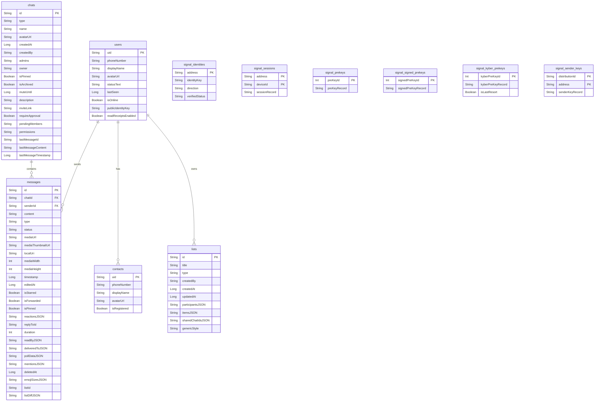

# Database Entity Schema (Room)

Local Room database schema — tables, columns, and relationships. Room is the single source of truth for the UI; Firestore and RTDB sync into it.

The app uses **two Room databases** so that destructive schema migrations on the application data never wipe Signal Protocol key material:

| Database         | File              | Tables                                                                                                                                                  |
| ---------------- | ----------------- | ------------------------------------------------------------------------------------------------------------------------------------------------------- |
| `AppDatabase`    | `fire_stream_chat.db` | `users`, `chats`, `messages`, `contacts`, `lists`                                                                                                       |
| `SignalDatabase` | `signal.db`       | `signal_identities`, `signal_sessions`, `signal_prekeys`, `signal_signed_prekeys`, `signal_kyber_prekeys`, `signal_sender_keys`, `signal_trusted_identities` |

`AppDatabase.MIGRATION_18_19` drops the legacy Signal tables from `fire_stream_chat.db`; from version 19 onward Signal keys live exclusively in `signal.db`.

_The seven Signal tables (`signal_identities`, `signal_sessions`, `signal_prekeys`, `signal_signed_prekeys`, `signal_kyber_prekeys`, `signal_sender_keys`, `signal_trusted_identities`) live in the dedicated `signal.db` and preserve the persistent cryptographic state required by the Signal Protocol, including post-quantum Kyber pre-keys. `signal_trusted_identities` is omitted from the diagram above for clarity but follows the same shape as `signal_identities`._

---

**See also:** [SCHEMA-FIRESTORE.md](SCHEMA-FIRESTORE.md) (remote source of truth), [DOMAIN-MODELS.md](DOMAIN-MODELS.md) (the Kotlin data classes these rows map to), [ARCHITECTURE.md](ARCHITECTURE.md) (overall architecture).
