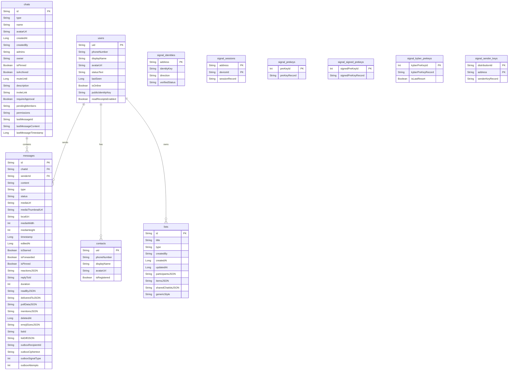

# Database Entity Schema (Room)

Local Room database schema — tables, columns, and relationships. Room is the single source of truth for the UI; Firestore and RTDB sync into it.

The app uses **two Room databases** so that destructive schema migrations on the application data never wipe Signal Protocol key material:

| Database         | File              | Tables                                                                                                                                                  |
| ---------------- | ----------------- | ------------------------------------------------------------------------------------------------------------------------------------------------------- |
| `AppDatabase`    | `fire_stream_chat.db` | `users`, `chats`, `messages`, `contacts`, `lists`                                                                                                       |
| `SignalDatabase` | `signal.db`       | `signal_identities`, `signal_sessions`, `signal_prekeys`, `signal_signed_prekeys`, `signal_kyber_prekeys`, `signal_sender_keys`, `signal_trusted_identities` |

`AppDatabase.MIGRATION_18_19` drops the legacy Signal tables from `fire_stream_chat.db`; from version 19 onward Signal keys live exclusively in `signal.db`.

**Outbox columns (`messages`, version 26).** Local send bookkeeping for an own row that has not reached `SENT`, written by `OutboxSender` and cleared by its SENT replace:

| Column | Meaning |
|---|---|
| `outboxRecipientId` | The 1:1 peer to encrypt for, recorded at insert; `""` for group and broadcast chats; `null` = not recorded, and `OutboxSender` refuses the row rather than send it in plaintext |
| `outboxCiphertext`, `outboxSignalType` | The Signal ciphertext of `content`, encrypted on the first attempt that reaches the write and reused by every later one |
| `outboxAttempts` | Pipeline runs started for the row; above 0 an earlier write may have landed, so the next write is create-if-absent |

They are not on the domain `Message`, so any other write to an unsent row must be a column update, never a whole-row replace ([`GOTCHAS.md`](GOTCHAS.md)). Version 26 is reached by destructive migration, like every `AppDatabase` bump except 18 → 19.

```mermaid
erDiagram
    users {
        String uid PK
        String phoneNumber
        String displayName
        String avatarUrl
        String statusText
        Long lastSeen
        Boolean isOnline
        String publicIdentityKey
        Boolean readReceiptsEnabled
    }

    chats {
        String id PK
        String type
        String name
        String avatarUrl
        Long createdAt
        String createdBy
        String admins
        String owner
        Boolean isPinned
        Boolean isArchived
        Long muteUntil
        String description
        String inviteLink
        Boolean requireApproval
        String pendingMembers
        String permissions
        String lastMessageId
        String lastMessageContent
        Long lastMessageTimestamp
    }

    messages {
        String id PK
        String chatId FK
        String senderId FK
        String content
        String type
        String status
        String mediaUrl
        String mediaThumbnailUrl
        String localUri
        Int mediaWidth
        Int mediaHeight
        Long timestamp
        Long editedAt
        Boolean isStarred
        Boolean isForwarded
        Boolean isPinned
        String reactionsJSON
        String replyToId
        Int duration
        String readByJSON
        String deliveredToJSON
        String pollDataJSON
        String mentionsJSON
        Long deletedAt
        String emojiSizesJSON
        String listId
        String listDiffJSON
        String outboxRecipientId
        String outboxCiphertext
        Int outboxSignalType
        Int outboxAttempts
    }

    contacts {
        String uid PK
        String phoneNumber
        String displayName
        String avatarUrl
        Boolean isRegistered
    }

    lists {
        String id PK
        String title
        String type
        String createdBy
        Long createdAt
        Long updatedAt
        String participantsJSON
        String itemsJSON
        String sharedChatIdsJSON
        String genericStyle
    }

    signal_identities {
        String address PK
        String identityKey
        String direction
        String verifiedStatus
    }

    signal_sessions {
        String address PK
        String deviceId PK
        String sessionRecord
    }

    signal_prekeys {
        Int preKeyId PK
        String preKeyRecord
    }

    signal_signed_prekeys {
        Int signedPreKeyId PK
        String signedPreKeyRecord
    }

    signal_kyber_prekeys {
        Int kyberPreKeyId PK
        String kyberPreKeyRecord
        Boolean isLastResort
    }

    signal_sender_keys {
        String distributionId PK
        String address PK
        String senderKeyRecord
    }

    chats ||--o{ messages : "contains"
    users ||--o{ messages : "sends"
    users ||--o{ contacts : "has"
    users ||--o{ lists : "owns"
```

_The seven Signal tables (`signal_identities`, `signal_sessions`, `signal_prekeys`, `signal_signed_prekeys`, `signal_kyber_prekeys`, `signal_sender_keys`, `signal_trusted_identities`) live in the dedicated `signal.db` and preserve the persistent cryptographic state required by the Signal Protocol, including post-quantum Kyber pre-keys. `signal_trusted_identities` is omitted from the diagram above for clarity but follows the same shape as `signal_identities`._

---

**See also:** [SCHEMA-FIRESTORE.md](SCHEMA-FIRESTORE.md) (remote source of truth), [DOMAIN-MODELS.md](DOMAIN-MODELS.md) (the Kotlin data classes these rows map to), [ARCHITECTURE.md](ARCHITECTURE.md) (overall architecture).
