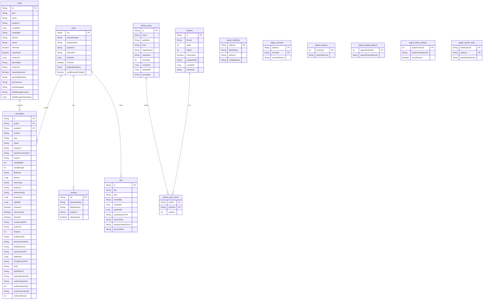

# Database Entity Schema (Room)

Local Room database schema — tables, columns, and relationships. Room is the single source of truth for the UI; Firestore and RTDB sync into it.

The app uses **two Room databases** so that destructive schema migrations on the application data never wipe Signal Protocol key material:

| Database         | File              | Tables                                                                                                                                                  |
| ---------------- | ----------------- | ------------------------------------------------------------------------------------------------------------------------------------------------------- |
| `AppDatabase`    | `fire_stream_chat.db` | `users`, `chats`, `messages`, `contacts`, `lists`, `reminders`, `stickers`, `sticker_packs`, `sticker_pack_items`                                       |
| `SignalDatabase` | `signal.db`       | `signal_identities`, `signal_sessions`, `signal_prekeys`, `signal_signed_prekeys`, `signal_kyber_prekeys`, `signal_sender_keys`, `signal_trusted_identities` |

`AppDatabase.MIGRATION_18_19` drops the legacy Signal tables from `fire_stream_chat.db`; from version 19 onward Signal keys live exclusively in `signal.db`.

**`messages` is two halves (version 28).** `MessageEntity` embeds a `MessageRecord` — every column the backend also holds — and keeps the local-only columns beside it: `localUri`, `isStarred` and the outbox bookkeeping below. `MessageRecord` doubles as Room's partial entity for the table: a snapshot, a sync, an edit echo or a poll vote is `MessageDao.upsertRecord`, which inserts the row when it is new and otherwise overwrites exactly the record's columns, so the local ones survive without being copied across. The local columns change only through column updates, the outbox insert of an own send (`MessageDao.insertOutbox`) and the SENT transaction (`MessageDao.markSent`). `isStarred` and `outboxAttempts` carry `DEFAULT 0` so a partial insert can omit them.

**Outbox columns.** Local send bookkeeping for an own row that has not reached `SENT`, written by the outbox insert and `OutboxSender`'s column updates, and cleared by one statement — `MessageDao.clearOutbox` — inside `markSent` and `acknowledge` (the heal of a row the backend turns out to hold):

| Column | Meaning |
|---|---|
| `outboxRecipientId` | The 1:1 peer to encrypt for, recorded at insert; `""` for group and broadcast chats; `null` = not recorded, and `OutboxSender` refuses the row rather than send it in plaintext |
| `outboxCiphertext`, `outboxSignalType` | The Signal ciphertext of `content`, encrypted on the first attempt that reaches the write and reused by every later one |
| `outboxPeerIdentity` | The peer identity key that ciphertext was encrypted for; a later attempt reuses the bytes only while the peer still publishes it (`SignalManager.isCurrentIdentity`), and encrypts again after a re-registration |
| `outboxAttempts` | Pipeline runs started for the row; above 0 an earlier write may have landed, so the next write is create-if-absent |

Version 28 is reached by destructive migration, like every `AppDatabase` bump except 18 → 19.

**The sticker library is three tables.** `stickers` holds one row per sticker file. Its `id` is the SHA-256 of the file's bytes, which is also the file's name under `filesDir/stickers/`. `sticker_packs` holds the packs, and `sticker_pack_items` puts a sticker into a pack at a `position`. A sticker can be in several packs and is in each at most once.

| Column | Meaning |
|---|---|
| `sticker_packs.id` | A random UUID. It is not derived from the pack's source, because it will be a backend document id that only its owner may write |
| `sticker_packs.importKey` | What an import made the pack from: a WhatsApp pack's id, name and publisher, an archive's title and author, or the loose pack's name. Unique. A second import finds the pack through it. The `FAVOURITES` and `SAVED` packs have the fixed keys `kind:FAVOURITES` and `kind:SAVED`, so the unique index keeps them at one each. `null` for a pack made by hand |
| `sticker_packs.kind` | `USER`, `INSTALLED`, `FAVOURITES` or `SAVED` |
| `sticker_packs.sortOrder` | The pack's place in the user's order |
| `sticker_packs.syncState` | `PENDING` or `SYNCED`. Every `StickerDao` write that changes a pack or its items sets `PENDING` and moves `updatedAt`. Nothing reads it yet |
| `sticker_pack_items.position` | Order inside the pack, ascending. A favourite is added in front, so positions can be negative |
| `stickers.remoteUrl` | Where the backend holds the file. `null` until this device has uploaded the sticker or found it there (`StickerObjectSource.ensureUploaded`). Never taken from a received message |

Removing a sticker from a pack, or deleting a pack, deletes item rows only. The `stickers` row and the file stay. A received sticker has a `stickers` row and no pack item.

**A `STICKER` message names its sticker (version 31).** `messages.stickerId` is the sticker's hash and `messages.stickerPackId` the pack it was sent from, or `null`. Both are part of `MessageRecord`, so a snapshot writes them. On a received row they are the sender's claim: the id is checked with `StickerFiles.isValidId` before it reaches a path, and against the downloaded bytes before a file is stored. The row's `localUri` is the sticker's file in `filesDir/stickers/`, shared by every message that points at that sticker. A `GIF` row's `localUri` is its copy in `filesDir/documents/`.

```mermaid
erDiagram
    users {
        String uid PK
        String phoneNumber
        String displayName
        String avatarUrl
        String statusText
        Long lastSeen
        Boolean isOnline
        String publicIdentityKey
        Boolean readReceiptsEnabled
    }

    chats {
        String id PK
        String type
        String name
        String avatarUrl
        Long createdAt
        String createdBy
        String admins
        String owner
        Boolean isPinned
        Boolean isArchived
        Long muteUntil
        String description
        String inviteLink
        Boolean requireApproval
        String pendingMembers
        String permissions
        String lastMessageId
        String lastMessageContent
        Long lastMessageTimestamp
    }

    messages {
        String id PK
        String chatId FK
        String senderId FK
        String content
        String type
        String status
        String mediaUrl
        String mediaThumbnailUrl
        String localUri
        Int mediaWidth
        Int mediaHeight
        String fileName
        Long fileSize
        String mimeType
        String stickerId
        String stickerPackId
        Long timestamp
        Long editedAt
        Boolean isStarred
        Boolean isForwarded
        Boolean isPinned
        String reactionsJSON
        String replyToId
        Int duration
        String readByJSON
        String deliveredToJSON
        String pollDataJSON
        String mentionsJSON
        Long deletedAt
        String emojiSizesJSON
        String listId
        String listDiffJSON
        String outboxRecipientId
        String outboxCiphertext
        Int outboxSignalType
        String outboxPeerIdentity
        Int outboxAttempts
    }

    contacts {
        String uid PK
        String phoneNumber
        String displayName
        String avatarUrl
        Boolean isRegistered
    }

    lists {
        String id PK
        String title
        String type
        String createdBy
        Long createdAt
        Long updatedAt
        String participantsJSON
        String itemsJSON
        String sharedChatIdsJSON
        String genericStyle
    }

    stickers {
        String id PK
        String format
        Int width
        Int height
        Boolean isAnimated
        String emojisJSON
        Long createdAt
        String remoteUrl
    }

    sticker_packs {
        String id PK
        String name
        String publisher
        String kind
        String originPackId
        String importKey
        Int sortOrder
        Long createdAt
        Long updatedAt
        String syncState
    }

    sticker_pack_items {
        String packId PK
        String stickerId PK
        Int position
    }

    signal_identities {
        String address PK
        String identityKey
        String direction
        String verifiedStatus
    }

    signal_sessions {
        String address PK
        String deviceId PK
        String sessionRecord
    }

    signal_prekeys {
        Int preKeyId PK
        String preKeyRecord
    }

    signal_signed_prekeys {
        Int signedPreKeyId PK
        String signedPreKeyRecord
    }

    signal_kyber_prekeys {
        Int kyberPreKeyId PK
        String kyberPreKeyRecord
        Boolean isLastResort
    }

    signal_sender_keys {
        String distributionId PK
        String address PK
        String senderKeyRecord
    }

    chats ||--o{ messages : "contains"
    users ||--o{ messages : "sends"
    users ||--o{ contacts : "has"
    users ||--o{ lists : "owns"
    sticker_packs ||--o{ sticker_pack_items : "orders"
    stickers ||--o{ sticker_pack_items : "is in"
```

_The seven Signal tables (`signal_identities`, `signal_sessions`, `signal_prekeys`, `signal_signed_prekeys`, `signal_kyber_prekeys`, `signal_sender_keys`, `signal_trusted_identities`) live in the dedicated `signal.db` and preserve the persistent cryptographic state required by the Signal Protocol, including post-quantum Kyber pre-keys. `signal_trusted_identities` is omitted from the diagram above for clarity but follows the same shape as `signal_identities`._

---

**See also:** [SCHEMA-FIRESTORE.md](SCHEMA-FIRESTORE.md) (remote source of truth), [DOMAIN-MODELS.md](DOMAIN-MODELS.md) (the Kotlin data classes these rows map to), [ARCHITECTURE.md](ARCHITECTURE.md) (overall architecture).
