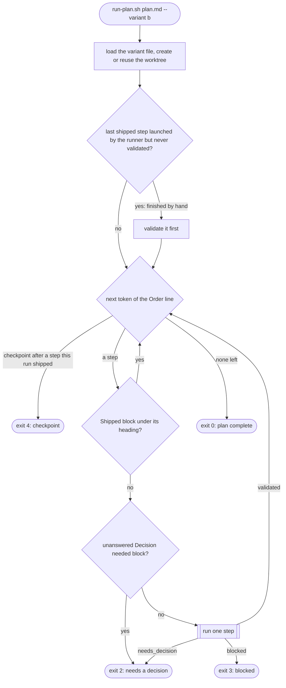
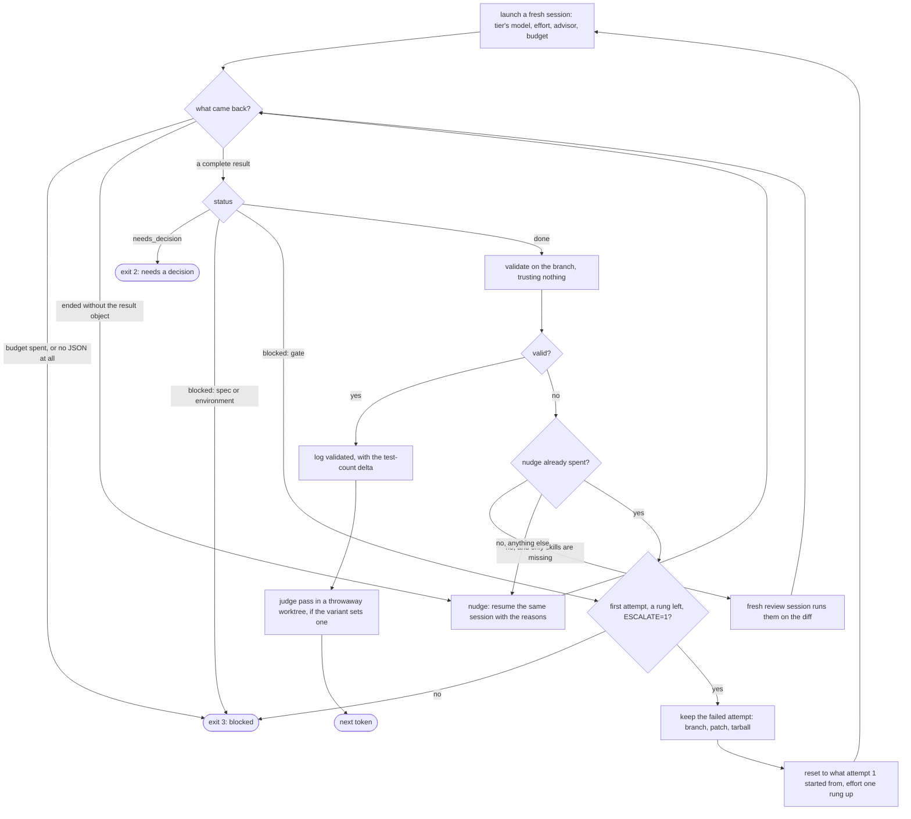

# Plan runner — how it runs

`scripts/run-plan.sh` is a bash loop with no model in it. It starts one fresh headless Claude
session per step, checks the branch itself before it believes a result, and stops for the human in
three situations. Contract and rationale: `docs/plans/done/plan-runner.md` (§5 for escalation,
variants, the review session and the judge). Keep the two diagrams below in step with
`handle_result` and the main loop when either changes. The same diagrams, with a who-writes-what
figure and the exit-code table, are a standalone page: `flow.html` next to this file (open it in a
browser; it loads mermaid and its fonts from a CDN).

## The loop over the plan

The plan's `Order:` line is the program: a number is a step, `‖` is a checkpoint. A step is done
only when a `**Shipped**` block sits under its heading in the branch's copy of the plan — that is
the runner's whole state, which is why a run can stop anywhere and be started again.

## One step

A step gets at most three kinds of help, each once — per step, across re-runs of the driver: a
nudge, then a fresh attempt one effort rung higher, then the human.

*Validate* is five checks the driver runs itself: HEAD moved; the `**Shipped**` line names a commit
on the branch; the plan file is committed; the Gradle gate, re-run by the driver, is green (skipped
for a docs-only diff); every required skill ran — the step's `skills:` tag plus what the diff
tripwire demands. What it takes on a session's word: that a skill listed as run was run, and that
the step met its spec — the judge grades that, nothing acts on the grade yet.

## Files

| File | Role |
|---|---|
| `../run-plan.sh` | The driver: tunables, worktree, launch, validate, nudge, escalate, judge, the main loop. |
| `lib.sh` | Pure functions (text in, text out): Order grammar, heading tags, Shipped/Decision blocks, tripwire, result classification, variant check. |
| `step-prompt.md` | What every step session is told. |
| `skills-prompt.md` | The fresh review session that stands in for the nudge when only skills are missing. |
| `judge-prompt.md`, `judge-result.schema.json` | The read-only grading pass and its result. |
| `step-result.schema.json` | The result every step session ends with. |
| `variants/*.env` | Named configurations for `--variant`; known keys only. |
| `report.sh` | Per-step table from one or more run logs. |
| `selfcheck.sh`, `fixtures/` | Pure-function and dry-run checks; runs in CI. |
| `e2e.sh` | The driver's control flow against a stub `claude` and `gradlew` in a scratch repo; called by `selfcheck.sh`. |
| `benchmark.md` | The 2026-09-20 configuration benchmark: protocol, results of every arm, the hand-read of the judge's findings, and the decision behind the mid-tier default. Raw run data stays in the gitignored `docs/plans/.runs/`. |
| `flow.html` | The two flow diagrams below plus a who-writes-what figure and the exit-code table, as a standalone page. |
